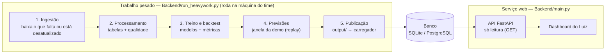

# O.R.A.C.U.L.O. — Documento de Planejamento da Solução (v2)

**Observabilidade de Redes e Análise de Curtailment em Usinas e Limites Operacionais**

Hackathon IA COPPE/UFRJ 2026 — Trilha Transição Energética · Desafios *Curtailment* e *Demanda energética, clima e operação do sistema*

> **Sobre este arquivo.** Transcrição em Markdown do PDF `ORACULO_Planejamento_v2`, feita em 2026-09-25 para que o plano fique versionado junto do código. As seções 1 a 12 reproduzem o PDF; as figuras (reproduzidas do Sumário Executivo do PAR/PEL 2025) não foram copiadas — ficam indicadas pela legenda. A **seção 13 não existe no PDF**: é o adendo com as decisões de implementação tomadas pelo time depois dele (arquitetura de execução com `run_heavywork.py`, decisões pendentes). Quando o PDF e o adendo divergirem, vale o adendo.

Versão revisada a partir do Caderno de Desafios, do PAR/PEL 2025 (Sumário Executivo e Revista), das transcrições do ONS (aula de dados, vídeo de *curtailment*, reunião PAR/PEL) e dos feedbacks da especialista do ONS no time.

**Entregável do Ideathon (confirmado na abertura):** um **PDF de até 10 slides**, submetido via formulário no **checkpoint 2** — abre 17h e encerra às 20h de domingo, dia 13 ("nem um minuto a mais"). Não há pitch gravado nem ao vivo: apenas o documento é avaliado. O critério explicitado é **articulação coerente entre problema e solução**, com peso adicional para o tamanho do problema atacado e a qualidade da proposta. Foi recomendado material **visual e objetivo** ("não é lugar de TCC"); wireframe/mockup é bem-vindo desde que caiba nas 10 páginas. Equipes de até 5 pessoas.

**Esclarecimento posterior (mentoria de negócios):** os 10 slides são de conteúdo — a capa e um eventual slide final de apresentação do time **não** entram nessa contagem. Este documento é o material-fonte: ele é maior que o entregável de propósito, para servir também de especificação técnica na fase do Hackathon presencial (25–27).

**Citar as fontes:**

- <https://www.ons.org.br/Paginas/energia-no-futuro/suprimentoeletrico/parpel2025/sumario-executivo/index.aspx>
- <https://dados.ons.org.br/>
- <https://www.ons.org.br/Paginas/faq_curtailment.aspx>

---

## 1. Sumário executivo

O Operador Nacional do Sistema Elétrico (ONS) atua como operador independente do Sistema Interligado Nacional (SIN) e representa o **Transmission System Operator (TSO)** no arranjo institucional brasileiro. O ONS é responsável pela coordenação e pelo controle da operação das instalações de geração e transmissão, visando assegurar o equilíbrio entre carga e geração e a operação segura, econômica e confiável do SIN. Com a rápida expansão dos **recursos energéticos distribuídos (REDs)**, parcela crescente da oferta passou a estar conectada diretamente às redes de distribuição e fora da visibilidade e controlabilidade do despacho centralizado pelo ONS.

Segundo o diagnóstico do **PAR/PEL 2025**, a **micro e minigeração distribuída (MMGD)** e as usinas classificadas na modalidade **Tipo III** já totalizavam cerca de **63,5 GW**, montante equivalente a aproximadamente **25% da capacidade instalada de geração**. Embora esses recursos influenciem diretamente o balanço energético e o desempenho elétrico do SIN, o ONS não dispõe sobre eles do mesmo nível de **observabilidade, previsibilidade e controlabilidade** existente para as usinas submetidas ao despacho centralizado. Em períodos do dia com elevada produção renovável de usinas fotovoltaicas e baixa demanda, essa condição reduz a carga líquida observada pelo Operador, amplia a complexidade do equilíbrio carga–geração para garantir a segurança operacional (com **inércia mínima assegurada**) e pode agravar a necessidade de restrições de geração (**curtailment**) por razão energética. O enfrentamento desse desafio não se limita, portanto, à expansão da transmissão: requer coordenação entre o ONS e as distribuidoras, responsáveis pela gestão dos recursos conectados às respectivas redes, além da integração de dados, previsões e mecanismos flexíveis de controle por meio de uma **interface ONS–DSO** amparada por regulamentação, ferramentas de análise avançadas e procedimentos operativos adequados. O ONS trata essa necessidade como prioridade, com o **Projeto Interface ONS/DSO** e o **Plano de Gestão de Excedentes de Energia na Rede de Distribuição** em curso.

Nesse contexto, a solução proposta estrutura-se em **dois eixos prioritários** para o tratamento dos impactos da geração distribuída na operação do SIN. O primeiro está relacionado ao aprimoramento da representação da carga e da MMGD nos estudos elétricos, mediante a caracterização de perfis de consumo e a presença de geração distribuída. Os resultados deverão fornecer insumos consistentes para a **parametrização, a validação e a calibração** dos modelos dinâmicos equivalentes de carga e MMGD empregados pelo ONS em estudos de estabilidade eletromecânica e na avaliação do comportamento dinâmico do SIN. Vislumbra-se, em particular, que essa frente possa subsidiar a parametrização e o aperfeiçoamento da representação do **Composite Load Model (CLM)**, reduzindo incertezas e aprimorando a precisão dos estudos elétricos. O segundo eixo consiste em fortalecer a **interface ONS–DSO**, fornecendo informações que ampliem a observabilidade e a previsibilidade do comportamento da carga e da micro e minigeração distribuída nas redes de distribuição. Busca-se, assim, subsidiar uma atuação mais ágil, flexível e coordenada entre o ONS e as distribuidoras.

Para viabilizar esses dois eixos, a equipe pretende desenvolver uma ferramenta capaz de integrar séries históricas operativas disponíveis no Portal de Dados Abertos do ONS, medições elétricas, variáveis meteorológicas, imagens de satélite e informações da Base de Dados Geográfica da Distribuidora (BDGD). As séries históricas e as medições serão utilizadas na caracterização dos perfis de consumo e de geração, enquanto as imagens de satélite, processadas por modelos de visão computacional, apoiarão o mapeamento da presença e da distribuição espacial dos sistemas de geração distribuída. Os resultados serão confrontados com os empreendimentos cadastrados na BDGD, permitindo avaliar a consistência e a complementaridade das diferentes fontes de informação. A partir dessa integração, a ferramenta deverá produzir insumos para a previsão da carga líquida, a construção de perfis representativos de carga e MMGD, a avaliação de cenários com elevada penetração de geração distribuída e a previsibilidade de condições operativas mais propensas à ocorrência de curtailment.

O O.R.A.C.U.L.O. constitui a camada de inteligência preditiva que integra e operacionaliza esses dois eixos. A solução combina dados de medição e séries históricas operativas disponibilizadas pelo ONS — incluindo os registros de restrições de geração por **constrained-off** —, informações georreferenciadas e topológicas das redes de distribuição, provenientes da BDGD e de bases abertas complementares, e variáveis meteorológicas. A partir dessa integração, pretende-se: (i) **prever a carga supervisionada e estimar a geração da MMGD por distribuidora**, compatível com a disponibilidade e a qualidade dos dados; (ii) **produzir indicadores preditivos do risco de curtailment por razão energética**. Dessa forma, a ferramenta busca reduzir a lacuna de observabilidade existente na fronteira entre transmissão e distribuição e fornecer subsídios qualificados à tomada de decisão do ONS.

**A experiência da equipe confere maturidade à proposta.** O O.R.A.C.U.L.O. foi estruturado para integrar, em uma única solução, competências em análise de sistemas elétricos de potência, tratamento de dados, visão computacional e modelagem preditiva. Sua arquitetura contempla: (i) aplicação para a caracterização dos perfis de carga e da inserção da MMGD, contemplando a parametrização e o mapeamento espacial da micro e minigeração distribuída sob a perspectiva das distribuidoras; (ii) recursos de validação, calibração e predição para incorporar visão sistêmica necessária ao fortalecimento da interface TSO–DSO. A proposta combina rigor técnico e inovação para ampliar a observabilidade das redes de distribuição, aprimorar a previsão da carga e da MMGD e antecipar condições operativas associadas ao risco de curtailment.

> **Frase-âncora do pitch:** o ONS dispõe de elevada observabilidade sobre o sistema sob sua supervisão; nas redes de distribuição, porém, essa visão ainda depende de informações agregadas e estimativas. O O.R.A.C.U.L.O. entrega ao operador a visibilidade preditiva da distribuição: onde está a MMGD, quanto poderá gerar nas horas seguintes, qual será seu impacto sobre a carga supervisionada e em quais regiões poderão surgir excedentes de geração. Com isso, decisões relacionadas à mobilização de recursos de flexibilidade e à gestão de excedentes podem deixar de ser predominantemente projeções e passar a ser antecipadas por dados estruturados.

**Por que o nome?** Um oráculo não representa uma adivinhação ao acaso, mas a capacidade de interpretar sinais. Na fronteira entre transmissão e distribuição, esses sinais já existem — BDGD, dados cadastrais da ANEEL, imagens de satélite, séries históricas operativas e variáveis meteorológicas —, mas ainda são analisados de maneira fragmentada. O O.R.A.C.U.L.O. integra essas informações e as transforma em inteligência preditiva para a operação do SIN.

## 2. O que mudou em relação à v1 do planejamento

A estrutura da v1 está preservada. O que muda é **precisão terminológica, correção de enquadramento e ancoragem em números oficiais**. Estes são os pontos que precisam necessariamente aparecer corrigidos nos 10 slides:

| Ponto | Como estava (v1) | Como deve ser (v2) e por quê |
|---|---|---|
| Papel do ONS no corte | "Usinas são **obrigadas pelo ONS** a cortar sua produção"; "desperdício de bilhões". | O ONS **não pune nem obriga por escolha**: ele coordena a redução de geração para **preservar o equilíbrio instantâneo carga–geração** e evitar risco de **colapso/blecaute**, dentro da sua missão de suprir energia com segurança ao menor custo global. Na comunicação oficial do próprio ONS a analogia é o voo com **overbooking**: alguns passageiros não embarcam **para que o voo aconteça com segurança**. Usar "restrição de geração solicitada pelo ONS por razões de segurança/energéticas", nunca "imposição". |
| Termo técnico | "Curtailment (Constrained-Off)" usados de forma solta. | São **equivalentes no âmbito regulatório brasileiro** (Análise de Impacto Regulatório nº 2022-002/SRG da ANEEL); a terminologia formal na regulação é **constrained-off**. Usar "curtailment" como termo geral e citar a equivalência uma vez — mostra domínio. |
| Causa dominante | Ênfase em **gargalo de transmissão**. | Inverteu-se: **desde abril/2025 a razão energética (ENE) supera as demais** e é a que mais cresce. Gargalo elétrico segue relevante (exportação NE e N/NE), mas está sendo mitigado por obras. O corte é hoje um **problema de sobreoferta no período diurno**, não principalmente de fio. |
| Classificação | "Restrições físicas ou razão energética". | Três macrorrazões do ONS, com códigos nas bases: **REL** (indisponibilidade externa/elétrica), **CNF** (confiabilidade e segurança), **ENE** (razão energética), além de **PAR** (parecer de acesso); origem **LOC** ou **SIS**. Marco: **REN 1.030/2022**. Só a razão energética **não é ressarcida** hoje — e é exatamente a que cresce. |
| TSO / DSO | Falava-se em "topologia micro" sem nomear a lacuna institucional. | O ONS é o **TSO**; **não existe DSO constituído no Brasil** e, portanto, **não existe interface de comunicação TSO–DSO**. Falta controlabilidade e falta regulamentação. É **essa lacuna** que dá razão de existir à solução — e o ONS já a reconheceu formalmente (Projeto Interface ONS/DSO, desde 2024). |
| "Demanda oculta" | "O ONS não consegue prever a rampa"; "painéis clandestinos". | O ONS **já prevê**: estima MMGD, prevê a **carga global** e abate a estimativa para chegar à **carga supervisionada** (a que ele de fato opera). A dor declarada não é "não prever", é a **defasagem do cadastro** (a MMGD gera antes de o registro chegar via distribuidora → ANEEL) e a **granularidade espacial**. Trocar "clandestino" por **"não cadastrado ou com defasagem de registro"**. |
| ERA5 | "Variáveis do ERA5 entram como covariáveis **conhecidas no futuro**". | Erro conceitual grave para banca do setor. **ERA5 é reanálise** (passado reconstruído), não previsão. Usar ERA5 para **treino e backtest**; em operação, as covariáveis futuras vêm de **modelos numéricos de previsão** (ECMWF, GFS, WRF), que é o que o ONS usa, junto com INMET. Assumir explicitamente o viés de **perfect-prog** ao treinar com reanálise. |
| Diferencial meteorológico | "Focalização climática" como novidade. | O ONS já roda grades de **25 km e 10 km** e já agrupa por **CEP das usinas**, com bom ajuste, e tem **três áreas de meteorologia**. Nosso diferencial não pode ser "trazer clima": é o **recorte espacial sobre a malha de distribuição** (manchas de MMGD e carga), onde a granularidade de fato falta. |
| "Gêmeo digital" | "Gêmeo Digital Preditivo". | Não há modelo elétrico/físico da rede na solução. Chamar de gêmeo digital convida à pergunta "cadê o fluxo de potência?". Usar **"camada de observabilidade e inteligência preditiva da fronteira T–D"**. Mantemos o acrônimo O.R.A.C.U.L.O. |
| Métrica de erro | Curvas P10/P50/P90 genéricas. | O ONS afirmou que **o erro de previsão de carga é assimétrico** (errar para baixo na ponta noturna é muito mais grave que errar para cima; errar para cima na mínima é mais grave que para baixo) e que **está estudando uma função de erro específica** para a curva de carga. Implementar **perda assimétrica / pinball por patamar** é um diferencial que fala diretamente com uma dor declarada. |

## 3. Os dois desafios, com números oficiais

O O.R.A.C.U.L.O. responde às **duas** perguntas orientadoras do Caderno — **Curtailment** e **Demanda energética, clima e operação do sistema** — como duas entregas explícitas e distintas, cada uma com contexto, causas e resposta próprios. A arquitetura é compartilhada porque as duas dependem do mesmo dado hoje ausente (a MMGD observável), mas as perguntas são respondidas separadamente, como o formato exige.

### 3.1 Desafio 1 — Curtailment

**Pergunta orientadora do Caderno:** "Como a inteligência artificial e a análise de dados podem ajudar a compreender, antecipar ou enfrentar o curtailment, ampliando o aproveitamento da geração renovável sem comprometer a segurança do sistema elétrico?"

#### Contexto: um problema de sobreoferta diurna, estrutural e crescente

Em 2025, cerca de **20% da geração potencial eólica e solar** foi objeto de cortes; estudo da Volt Robotics a partir de dados do ONS estimou **4.021 MW médios** cortados e perdas de aproximadamente **R$ 6,5 bilhões** no ano (Caderno de Desafios). O ONS relata que o comando de restrição total (todas as eólicas e fotovoltaicas a zero) — inédito no Dia dos Pais de 2024 — passou a ocorrer com **frequência quase semanal** por baixa demanda.

> **Figura 1 — Evolução do curtailment (jan/23–out/25).** Barras: montante cortado por classificação (vermelho = indisponibilidade externa, roxo = confiabilidade, verde = razão energética). Linhas: crescimento da capacidade instalada EOL+UFV+MMGD (+~40 GW) contra a variação da carga média (<10 GW), ambas relativas a jan/2023. *Fonte: ONS, PAR/PEL 2025 — Sumário Executivo.*
>
> **Uso no pitch:** um único gráfico prova a tese central — a oferta diurna cresceu ~4× mais rápido que a carga, e o verde (ENE) passa a dominar a partir de abr/2025.

A projeção do próprio ONS para 2026–2029 (metodologia de extrapolação determinística sobre 8.760 pontos horários verificados de out/2024 a set/2025, gerando ~35 mil pontos futuros) mostra que o problema é **estruturalmente concentrado na janela solar**:

| Faixa horária | % do tempo com corte (2026–2029) | Maior corte projetado |
|---|---|---|
| 00:00–06:59 | 2,9% | 10 GW |
| 07:00–08:59 e 16:00–17:59 | 37,6% | 42 GW |
| 09:00–15:59 (platô solar) | 74,9% | 52 GW |
| 18:00–23:59 | 2,4% | 8 GW |

*Base PEN/PMO + MMGD 4MD. Em cenário com base CUST + 4MD, o corte máximo passa de 60 GW e o tempo com corte na janela diurna supera 80%.*

> **Figura 2 — Distribuição da projeção dos cortes ao longo do tempo (2026–2029).** Cada ponto é uma das 8.760 horas de cada ano futuro. *Fonte: ONS, PAR/PEL 2025.*
>
> **Uso no pitch:** sustenta a afirmação de que 100 MW adicionais de geração diurna hoje entram num sistema que, em ~3 de cada 4 horas do dia, já está transbordando.

O corte médio projetado sai de ~2.900 MWmed (2026) para ~3.600 MWmed (2029). Por fonte, a eólica se estabiliza em ~11% da geração potencial cortada, enquanto a **fotovoltaica sobe de ~24% para ~28%**, justamente por concentração diurna. E a conclusão do ONS é explícita: **a redução significativa do curtailment não virá só de grandes consumidores, baterias ou resposta da demanda** — a simulação com 4 GW de novas cargas eletrointensivas em 2029 (3 GW NE + 1 GW SE) reduz o corte médio de ~3.600 para ~2.900 MWmed, uma eficiência teórica **inferior a 20%** do montante de carga alocado, porque a carga é *flat* e o corte é concentrado.

#### Motivos da restrição (classificação do ONS)

O ONS agrupa as restrições em três macrorrazões, cada uma com efeito e resposta distintos — entender essa diferença é, segundo o próprio Caderno, parte do desafio: **REL** (indisponibilidade externa/elétrica, fora das instalações da usina), **CNF** (confiabilidade, necessária para preservar a segurança da operação — por exemplo, limites de exportação Nordeste e Norte/Nordeste) e **ENE** (razão energética, quando a geração disponível supera a demanda ou a capacidade momentânea de absorção). Desde abril de 2025, **ENE supera as demais e é a que mais cresce** — o problema deixou de ser predominantemente de gargalo de fio e passou a ser de sobreoferta diurna.

> **Resposta à pergunta orientadora (Desafio 1):** o O.R.A.C.U.L.O. antecipa o curtailment classificando o risco **por razão** (ENE vs. CNF, porque pedem respostas operativas diferentes), com granularidade espacial suficiente para localizar onde a MMGD vai gerar excedente antes que ele se manifeste no balanço do subsistema. Isso não elimina o corte — nenhuma solução de IA o elimina, e afirmar isso queimaria credibilidade com uma banca que terá gente do ONS — mas **reduz a margem de conservadorismo** operativo e **antecipa a alocação dos recursos de flexibilidade** (deslocamento de carga, resposta da demanda, armazenamento, gestão hidráulica, plano de excedentes na distribuição), ampliando o aproveitamento da geração renovável sem comprometer a segurança — que é exatamente o que a pergunta orientadora pede.

### 3.2 Desafio 2 — Demanda energética, clima e operação do sistema

**Pergunta orientadora do Caderno:** "Como a inteligência artificial e a análise de dados podem ajudar a compreender os fatores que influenciam a demanda de energia elétrica e apoiar uma operação mais segura e eficiente do sistema elétrico?"

#### Contexto: o que move a curva

O ONS prevê a **carga global** (comportamento humano de consumo) e dela abate a geração que não supervisiona — MMGD e usinas **Tipo III** — chegando à **carga supervisionada**, que é a que ele efetivamente opera. Quanto maior a MMGD, mais baixa a barriga do pato e mais violenta a rampa do fim de tarde. Esse formato — vale profundo ao meio-dia, quando a geração solar substitui a carga da rede, seguido de uma subida abrupta ao entardecer, quando o sol se põe e a demanda residencial chega — é o que o próprio setor elétrico batizou de **Curva do Pato (Duck Curve)**: o "pescoço" é a rampa vespertina e a "barriga" é o vale de carga supervisionada mínima. O termo nasceu na CAISO (Califórnia) para descrever exatamente esse efeito da geração solar em larga escala, e o ONS o usa informalmente na mesma acepção — "o pato cada vez mais deitado", "a barriga do pato encostando no zero". É o gancho mental mais eficiente para explicar o problema em um pitch: um único desenho (Figuras 3 e 4) comunica, sem jargão, por que a rede precisa de flexibilidade duas vezes ao dia — para absorver o vale e para suprir a rampa.

#### Demanda e consumo

Distinção que o Caderno de Desafios cobra explicitamente e que precisa aparecer no nosso material: **demanda** é a potência solicitada num intervalo de tempo; **consumo** é a energia total num período. Dois dias com o mesmo consumo podem exigir condições operativas completamente diferentes — quando o uso se concentra em poucas horas, a demanda máxima sobe e o problema deixa de ser energético e passa a ser de potência e de flexibilidade. É por isso que o desafio de demanda não se resolve prevendo "quanta energia o Brasil vai consumir": resolve-se prevendo **a forma da curva**, hora a hora, e sobretudo os seus extremos.

#### O que o ONS já opera hoje — e onde ficam as lacunas

Não estamos entrando num terreno vazio, e o material deve deixar isso claro (a banca terá gente do ONS). A cadeia atual, conforme apresentada na aula de dados:

- **Modelos de apoio à decisão:** PREVCARGA para tempo real e curtíssimo prazo, PREVCARGA PMO para a programação, e modelos específicos de **previsão de GD e MMGD**, cujo resultado é abatido da carga global.
- **Granularidade:** previsões **horárias** com desagregação posterior **semi-horária** — a previsão direta no meio da hora é reconhecidamente mais difícil pela complexidade da série.
- **Horizontes:** tempo real, programação diária, PMO e planejamento; em tempo real, defasagem de meia hora e **atualização a cada 30 minutos**.
- **Insumos meteorológicos:** previsões de irradiância, nebulosidade, precipitação, vento, temperatura e **temperatura de ponto de orvalho para cálculo de desconforto térmico**, vindas de ECMWF, GFS, WRF e NOAA, além de reanálise ERA5, estações automáticas do INMET e registros de geração da CCEE. O ONS mantém hoje **três áreas de meteorologia**.
- **Recortes:** quatro subsistemas (Sudeste/Centro-Oeste, Sul, Norte, Nordeste), operados por quatro centros regionais mais o nacional. **Atenção:** subsistemas **não** coincidem com as áreas operativas — confundir os dois recortes ao cruzar bases é um erro clássico e visível.

**As lacunas reais, declaradas pelo próprio operador:** (i) a **defasagem do cadastro de GD** — a MMGD já está gerando quando o registro ainda percorre o caminho distribuidora → ANEEL, de modo que a estimativa parte de uma capacidade instalada subdimensionada; (ii) a **granularidade espacial** da estimativa de MMGD e de carga, hoje agregada de forma grosseira frente à heterogeneidade da penetração por estado e por mancha urbana; (iii) a **função de erro** inadequada, tratada a seguir. São exatamente esses três pontos que o O.R.A.C.U.L.O. ataca — não a substituição do PREVCARGA.

#### Os fatores que influenciam a demanda

A demanda deixou de ser uma série bem-comportada com sazonalidade previsível. Os vetores que o ONS e o Caderno destacam:

| Vetor | Efeito sobre a curva e implicação para o modelo |
|---|---|
| MMGD | Reduz a carga supervisionada no período diurno e amplifica a rampa vespertina. Efeito espacialmente muito desigual — exige tratamento por mancha, não por subsistema. |
| Data centers e cargas de IA | Novos mercados eletrointensivos em escala global, com perfil de consumo *flat* e forte concentração geográfica. O PAR/PEL simula 4 GW adicionais em 2029 (3 GW NE + 1 GW SE). Por serem *flat*, aliviam a madrugada e a noite, mas pouco a janela solar — daí a eficiência teórica inferior a 20% na redução do corte. |
| Eletrificação da mobilidade | Altera padrões tradicionais de consumo e desloca demanda para o período noturno, potencialmente agravando a ponta — ou aliviando-a, se houver sinal de preço e carregamento gerenciado. Feature de cenário, não de curto prazo. |
| Clima extremo | Ondas de calor alteram o comportamento do consumidor de forma **não uniforme** entre regiões e horários. Modelar com temperatura, ponto de orvalho e índices de desconforto térmico, com efeitos não lineares e com memória (dias consecutivos de calor acumulam). |
| Baterias e resposta da demanda | Leilão de baterias em curso; resposta da demanda ainda pouco acionada no Brasil. Ambos deslocam consumo e, portanto, mudam o alvo da previsão. Tratar como recursos que a previsão precisa **informar**, não como variáveis exógenas fixas. |
| Crescimento estrutural | Carga máxima do SIN projetada em ~**129 GW em 2030**, +17% sobre a máxima não coincidente verificada em 2025 (PAR/PEL 2025). |

> **Figura 3 — Curvas de carga supervisionada mínima (2023, 2024, 2025).** A mínima cai de **40.373 MW (05/nov/23, com 25,6 GW de MMGD)** para **39.024 MW (11/ago/24, 32,8 GW)** e **31.804 MW (10/ago/25, 42,8 GW)**. *Fonte: ONS, PAR/PEL 2025.*
>
> **Uso no pitch:** a MMGD cresce mais rápido que a carga e o vale diurno afunda ano a ano — é a materialização visual do problema que a solução ataca.

> **Figura 4 — Modulação das fontes no dia da carga supervisionada mínima de 2025 (10/08/2025, 13:05).** Demanda supervisionada mínima do SIN de **31.804 MW**, com a geração distribuída representando **44,8% da geração total** naquele instante. *Fonte: ONS, PAR/PEL 2025.*

#### A rampa: onde a operação realmente dói

Na operação, o ONS relata rampas de **35 GW para 80–90 GW em 5 a 6 horas**, exigindo coordenação sistêmica de intercâmbio (Nordeste exportando para o Sudeste) e acionamento de térmicas mais caras, com impacto direto em CMO/PLD. A projeção para 2029 agrava:

> **Figura 5 — Análise prospectiva 2029: maior amplitude diária da carga supervisionada.** Mínima de **29,6 GW às 10h**, máxima de **89,3 GW às 19h**: amplitude diária de **59,8 GW**, com necessidade de rampear ~**33,6 GW em 3 horas**. *Fonte: ONS, PAR/PEL 2025.*
>
> **Uso no pitch:** justifica por que meia hora de antecipação com boa acurácia vale dinheiro e segurança.

**Requisito operacional declarado pelo ONS (Q&A da aula de dados):** os modelos de previsão de carga trabalham com **defasagem de meia hora** para tempo real, com horizontes de **30 min, 3 h e até o dia seguinte**, e **atualização a cada 30 minutos**. Nossa solução deve nascer com essa cadência — é o que a torna plugável no processo real, e não um exercício acadêmico. *(Ver seção 13.1 para como isso é atendido no MVP.)*

#### A assimetria do erro — a lacuna metodológica declarada

Diferentemente de outras previsões, na curva de carga o erro não tem peso uniforme: errar **para baixo na ponta noturna** é muito mais arriscado que errar para cima; errar **para cima na carga mínima** é mais arriscado que errar para baixo; e errar sistematicamente para baixo dispara custo. O ONS declarou que **ainda não tem** uma função de erro específica para a curva de carga e que sabe que esse é o caminho. Uma métrica simétrica como MAPE trata igualmente dois erros de custo radicalmente diferente: subestimar a ponta noturna pode significar acionamento emergencial ou risco de não atendimento; superestimá-la significa térmica cara ligada à toa. Esse é um espaço técnico aberto que podemos ocupar explicitamente, com **perda assimétrica parametrizada por patamar**.

> **Resposta à pergunta orientadora (Desafio 2):** o O.R.A.C.U.L.O. decompõe a demanda em carga global prevista menos MMGD estimada, tratando explicitamente os fatores que a movem — calendário e efeito fim de semana/feriado, temperatura e desconforto térmico, irradiância por mancha, e vetores estruturais como MMGD, cargas eletrointensivas e eletrificação da mobilidade — com uma **função de perda assimétrica por patamar** que reflete o custo real de errar para cima ou para baixo em cada momento do dia. O resultado é uma previsão de carga supervisionada mais confiável nos horários que mais importam para a operação: a mínima diurna e a ponta noturna. Isso apoia diretamente uma operação mais segura e eficiente, respondendo ao que a pergunta orientadora pede.

### 3.3 O elo institucional comum às duas perguntas

As duas respostas acima dependem da mesma lacuna, e por isso a arquitetura é compartilhada — sem que isso reduza os dois desafios a um só: o ONS é o **TSO**, não existe **DSO** constituído no Brasil, e por isso não existe interface TSO–DSO. É essa lacuna institucional, documentada a seguir, que torna tanto o curtailment por razão energética quanto o erro de previsão de carga mais difíceis de resolver do que seriam com a MMGD plenamente observável.

> **Figura 6 — Expansão verificada e prevista da MMGD.** De 0,2 GW (2017) a **43,5 GW (2025)**, com projeção de ~**65 GW em 2029** (metodologia 4MD) contra um cenário menor declarado pelas distribuidoras no PAR/PEL. Somando ~20 GW de Tipo III, chega-se a ≈ **63,5 GW na distribuição, ~25% da capacidade instalada do SIN**. *Fonte: ONS, PAR/PEL 2025.*

> **Figura 7 — Participação da GD (MMGD + Tipo III) no atendimento à demanda global.** Máximos: 36% (2023), 40% (2024), 46% (2025); projeção de **64% em 2029**. *Fonte: ONS, PAR/PEL 2025.*
>
> **Uso no pitch:** em termos energéticos médios a GD é ~15–20%; é nos **pontos de operação elétricos** que ela chega a metade do atendimento — e é ali que a falta de observabilidade vira risco.

As consequências desse arranjo, todas documentadas no PAR/PEL 2025:

- **Fluxo reverso na fronteira T–D.** A previsão sai de **203** para **217 transformações de fronteira** passíveis de operar em fluxo reverso, em **18 estados**. Em Goiás e Mato Grosso, **todas** as subestações de fronteira são passíveis. Nas SEs **Nova Mutum** 230/69 kV e **Brasnorte** 230/138 kV (MT) já há risco de sobrecarga em condição normal, e a medida operativa normatizada é o **corte manual da geração distribuída, executado pela distribuidora mediante solicitação do ONS** — hoje, por telefone e procedimento, não por interface.
- **Exportação da distribuição para a rede básica.** Em 10/08/2025, MT exportou **657 MW** e MS **906 MW** para a rede básica; Minas Gerais apresentou a maior amplitude de carga líquida estadual, ~**6 GW**.
- **Controle de tensão.** Naquele mesmo dia foram necessárias **26 linhas de transmissão abertas** para controle de tensão (estudos de curto prazo apontam até 30), e o número de manobras necessárias na transição diurno–noturno cresce na ordem de **+20%** (de ~200 para ~240).
- **Perda de controlabilidade.** Prospecção para 2029 mostra domingos em que todas as fontes centralizadas estão no mínimo técnico e a carga supervisionada ainda invade esse mínimo — excedente máximo de geração de **4.909 MW** entre 10h e 12h — exigindo acionar o plano de excedentes na distribuição. Dependendo da premissa de controle da inflexibilidade térmica, projetam-se de **7 a 12 dias por ano** com possibilidade de perda de controlabilidade já em 2026.
- **Coordenação de proteção.** Os ajustes de proteção de boa parte dos geradores distribuídos não são coordenados com as ações sistêmicas (ERAC), com risco de desligamento em cascata diante de perturbações na Rede Básica.

> **Figura 8 — Prospecção de um domingo de 2029: perda de controlabilidade.** Excedente de geração de até **4.909 MW** entre 10h e 12h com todas as fontes centralizadas no mínimo. *Fonte: ONS, PAR/PEL 2025.*

### 3.4 Por que uma arquitetura só resolve os dois desafios com mais eficiência

Os dois desafios continuam sendo **duas entregas distintas**, cada uma respondendo à sua própria pergunta orientadora (seções 3.1 e 3.2). O que justificamos aqui é uma decisão de engenharia, não uma fusão dos desafios: construir **um único modelo espacializado de MMGD** que alimenta as duas saídas, em vez de duas soluções independentes que reestimariam a mesma grandeza cada uma a seu modo.

**Onde o Desafio 2 alimenta o Desafio 1.** O curtailment por razão energética é o balanço carga–geração fechando à força. Quanto pior a previsão da carga supervisionada — que depende da estimativa de MMGD do Desafio 2 —, mais conservadora precisa ser a operação e maior a margem de corte aplicada.

**Onde o Desafio 1 alimenta o Desafio 2.** Gerenciar demanda de forma eficiente (deslocar consumo, acionar resposta da demanda) exige saber com antecedência onde e quando haverá excedente de geração — que é exatamente a saída do Desafio 1.

> **Como enunciar no pitch:** "Resolvemos os dois desafios propostos pelo ONS — curtailment e demanda — com uma arquitetura comum, porque ambos dependem da mesma grandeza hoje invisível ao TSO: quanto a MMGD vai gerar, em que ponto da malha, na próxima meia hora. Cada desafio recebe sua própria resposta; a eficiência vem de resolver a causa raiz compartilhada uma única vez."

## 4. Onde o O.R.A.C.U.L.O. se encaixa no que o ONS já está fazendo

Este é o argumento mais forte que temos, e a v1 não o usava: **não estamos propondo um problema novo ao ONS — estamos propondo uma camada técnica para duas das cinco frentes que ele já declarou publicamente.**

> **Figura 9 — Histórico de ações do ONS diante dos impactos da GD (2021–2025).** *Fonte: ONS, PAR/PEL 2025.*

> **Figura 10 — As cinco frentes atuais do ONS.** *Fonte: ONS, PAR/PEL 2025.*
>
> **Uso no pitch:** este é o slide de encaixe. Marcar visualmente as duas caixas que endereçamos.

| Frente do ONS | Situação | Contribuição do O.R.A.C.U.L.O. |
|---|---|---|
| Parametrização, validação e calibração de modelos de carga e de MMGD | Projeto iniciado em 2024, em parceria com instituto de P&D. Visa aprimorar os modelos de carga e MMGD nos estudos elétricos. | **Encaixe direto e principal.** Já entregamos a parametrização/mapeamento no trabalho anterior; agora entregamos **validação contra dados verificados, calibração espacial e predição probabilística** com granularidade de mancha de carga e de MMGD. |
| Projeto Interface ONS/DSO | Em curso desde 2024. Criação de marco regulatório para gestão de usinas Tipo III e MMGD em colaboração com as distribuidoras. | **Segundo encaixe.** Propomos o **conteúdo informacional dessa interface**: qual grandeza, com que granularidade, com que antecedência e em que formato TSO e DSO precisam trocar para que a gestão de excedentes seja executável. Uma interface precisa de um *payload*; nós propomos o *payload*. |
| Plano de Gestão de Excedentes na Rede de Distribuição | Dois workshops com distribuidoras; hoje o corte na área de concessão é solicitado sem previsão espacializada. | Adjacência: prever **onde e quando** haverá excedente por área permite acionamento planejado em vez de emergencial. |
| Revisão de classificação de modalidades de operação / Atualização do Módulo 3 do PRODIST | Em consulta externa e em desenvolvimento com universidades e ANEEL. | Fora do nosso escopo (regulatório/requisitos técnicos). Citar para mostrar leitura do contexto, não reivindicar. |

## 5. Arquitetura da solução

### Pilar 0 — Ingestão, contratos de dados e integração com o ecossistema do ONS (novo)

- **Portal de Dados Abertos do ONS** (dados.ons.org.br): 85 conjuntos de dados, acesso livre sem login, com **dicionários de dados oficiais** (campos, tipos, formatos, domínios) que dão contexto de negócio e devem ser usados na modelagem.
- **MCP oficial do ONS** — o primeiro MCP do setor elétrico, com camada semântica e **contratos de dados** curados, código aberto no GitHub. A equipe do ONS **convidou explicitamente** os participantes a contribuírem com **novas *tools*, inclusive de previsão**. **Proposta de diferencial:** expor os modelos do O.R.A.C.U.L.O. como *tools* no MCP do ONS, devolvendo a solução ao ecossistema em vez de criar mais um silo. Isso responde a um pedido feito em voz alta pela instituição dona do problema.
- **Ambiente conversacional "glass box"** do ONS (mostra dataset de origem, racional e query aplicada): referência de padrão de transparência que nosso módulo de explicabilidade deve seguir.

> *Implementação (adendo):* a ingestão roda no script `Backend/run_heavywork.py`, fora do serviço web — ver seção 13.1. Ela usa a API CKAN do portal, e não o MCP — ver seção 13.3.

### Pilar 1 — Engenharia de dados espaciais: o elo micro–macro

- **Ingestão e sanitização da BDGD** (ANEEL): localização de subestações, alimentadores, transformadores de distribuição, unidades consumidoras e GD cadastrada, com normalização de lacunas e nomenclaturas divergentes entre distribuidoras.
- **Enriquecimento multifonte** (Open Buildings, IBGE, OpenStreetMap) para validar densidade construída onde a BDGD é falha.
- **Geometria de agregação:** polígonos por mancha de carga/MMGD (fecho convexo e alternativas côncavas) em torno de transformadores e alimentadores; para geração centralizada, perímetro dos complexos.
- **Ganho sobre o estado atual:** o ONS agrupa hoje por CEP das usinas, com grades de 25 km e 10 km — adequado para o parque centralizado. O ganho está em **resolver a MMGD e a carga em manchas sub-municipais**, de modo que a nebulosidade sobre metade de uma região metropolitana se traduza em MW estimados de perda de geração distribuída e em acréscimo de carga na transmissão nos minutos seguintes.

### Pilar 2 — Visão computacional: a auditoria em 3 camadas ("o tira-teima diário")

O ponto fraco de qualquer estimativa de MMGD é confiar em uma única fonte. A BDGD é topológica, mas atualizada com periodicidade baixa; o cadastro de GD da ANEEL é mais dinâmico, mas não localiza a unidade na malha; e nenhuma das duas prova, por si só, que o painel cadastrado está de fato instalado e gerando **hoje**. O O.R.A.C.U.L.O. resolve isso cruzando três camadas de evidência, cada uma respondendo a uma pergunta diferente:

- **Camada 1 — Realidade física (YOLOv8-seg, imagem de satélite):** *o painel existe fisicamente no telhado?* Segmentação de instâncias com *fine-tuning* local (degradação artificial para simular a qualidade das imagens disponíveis no Brasil), dentro dos polígonos do Pilar 1. Responde à existência física, mas tem defasagem de captura (a imagem pode ter meses).
- **Camada 2 — Topologia mensal (BDGD, ANEEL):** *a que ponto da rede aquela unidade está conectada?* Localiza a UC no transformador/alimentador correto, mas com atualização tipicamente anual e nomenclatura heterogênea entre distribuidoras.
- **Camada 3 — Cadastro diário (Planilha de Empreendimentos de Geração Distribuída, ANEEL):** *esse empreendimento já foi homologado, e quando?* É a peça que faltava na v1 do planejamento: essa base tem **atualização diária**, muito mais rápida que a BDGD, e é o que permite atribuir uma **data de homologação** a cada unidade.

**A lógica de desempate.** O valor da solução não está em nenhuma camada isolada, mas no cruzamento das três. Quando o YOLO detecta um painel (Camada 1) que ainda não aparece na BDGD (Camada 2), a Camada 3 desempata o caso:

- Se a unidade **consta na planilha diária da ANEEL** com data de homologação recente e a BDGD simplesmente não teve tempo de absorver a atualização (seu ciclo é mais lento) → classificar como **Lag de Sistema**: MMGD legítima, defasagem puramente administrativa entre bases. É exatamente a dor que o ONS declarou na aula de dados — o registro chega depois de a usina já estar gerando.
- Se a unidade **não consta** em nenhuma homologação registrada, apesar de fisicamente presente e gerando → sinalizar como **instalação não homologada**, para tratamento à parte (não entra no fator de correção de capacidade cadastrada; é escalada como exceção, não silenciosamente incorporada à previsão).

Esse desempate diário é o que torna o fator de correção de capacidade instalada **confiável para o motor preditivo do Pilar 3**: sem ele, o modelo trataria lag administrativo e instalação irregular como a mesma coisa, inflando ou corrigindo a MMGD estimada com base errada.

Para geração centralizada, o mesmo princípio de auditoria (Camada 1) se aplica à área física de painéis em usinas em construção/expansão, como sanidade da capacidade reportada.

**Limitação a declarar:** disponibilidade, custo e data das imagens de satélite; a Camada 1 é **periódica** (mensal/trimestral), não em tempo real. As Camadas 2 e 3 têm cadências diferentes entre si (anual vs. diária) e são elas — não a imagem — que carregam o peso da atualização contínua. A auditoria alimenta o cadastro que o preditor consome; não é, ela própria, o preditor.

### Pilar 3 — Motor preditivo temporal

- **Entradas:** histórico de *constrained-off* do ONS (bases **tm** e **detail**, eólica e fotovoltaica), curva de carga verificada e MMGD estimada, acionamento de térmicas por motivo de despacho, capacidade instalada corrigida (Pilares 1–2), e variáveis meteorológicas.
- **Features do lado da demanda** (endereçando a pergunta orientadora daquele desafio): calendário e efeito de feriado/fim de semana — os mínimos históricos de carga supervisionada caíram em domingos e no Dia dos Pais, não em dias úteis; temperatura, ponto de orvalho e **índice de desconforto térmico** com efeitos não lineares e defasados (acúmulo de dias quentes); irradiância e nebulosidade por mancha; e, como variáveis de cenário de médio prazo, entrada de cargas eletrointensivas e eletrificação da mobilidade.
- **Meteorologia — enquadramento correto:** **ERA5 (reanálise)** para treino, backtest e reconstrução histórica; **previsões numéricas** (ECMWF, GFS, WRF) e estações do INMET como covariáveis futuras em operação. Declarar o viés de treinar com reanálise e avaliar a degradação ao substituir por previsão.
- **Modelo:** **Temporal Fusion Transformer** com saídas por quantis, mais **baselines** obrigatórios (persistência, sazonal-naïve, gradient boosting sobre *features* de calendário e clima). Sem baseline, nenhum número de acurácia significa nada para a banca.
- **Função de perda assimétrica** por patamar horário, refletindo o custo real do erro: penalização maior para subestimação na ponta noturna e para superestimação na carga mínima diurna. Este é o item que dialoga com a lacuna que o próprio ONS declarou estar estudando.
- **Saída 1 — Previsão de carga supervisionada**, probabilística (P10/P50/P90), horizontes de 30 min, 3 h e D+1, atualização a cada 30 min, com decomposição explícita: carga global prevista − MMGD estimada = carga supervisionada.
- **Saída 2 — Risco de curtailment**, como **classificação probabilística por razão** (ENE vs. CNF), não como número único: são fenômenos com causas e respostas diferentes, e o Caderno de Desafios afirma que entender essa diferença é parte do desafio. Para ENE, o preditor é o balanço carga–geração projetado contra o mínimo técnico hidráulico; para CNF, os limites de exportação NE e N/NE.

### Pilar 4 — Camada de decisão e interface TSO–DSO

- **Mapa híbrido:** rede macro (usinas, limites de intercâmbio, alertas de restrição) sobreposta a manchas de densidade de MMGD e carga por área de concessão — relação de causa e efeito geográfica.
- **Painel de despacho preditivo:** carga supervisionada esperada com banda de incerteza, rampa projetada, e "margem até o mínimo técnico" das fontes controláveis.
- **Painel de excedentes (a peça de interface TSO–DSO):** por área de concessão e por transformação de fronteira, previsão de excedente e de fluxo reverso, com antecedência suficiente para acionamento coordenado — exatamente o processo hoje executado por solicitação manual do ONS às distribuidoras (casos Nova Mutum e Brasnorte).
- **Módulo de explicabilidade:** peso das variáveis por alerta, dataset de origem e consulta aplicada, no padrão *glass box* que o próprio ONS adota. Isso não fica em abstrato — é o que o operador efetivamente lê na tela. Exemplo do texto de um alerta gerado pela Saída 2 do Pilar 3:

> **⚠ ALERTA — Risco de Curtailment**
> Probabilidade de **85%** de necessidade de **curtailment de 50 MW** no Parque Eólico X, amanhã às **14h**.
> **Motivo:** 65% Condição de Vento Extremo (ERA5/previsão numérica) · 35% Histórico de Restrição de Confiabilidade da Linha Y (CNF)
> Fonte: dataset constrained_off_eolica_tm · janela de previsão D+1 · atualizado há 12 min

O formato reproduz deliberadamente o padrão *glass box* do próprio ambiente conversacional do ONS: probabilidade acionável, motivo decomposto por peso de variável e por razão (aqui, confiabilidade elétrica dividindo espaço com condição meteorológica), e rastreabilidade até o dataset de origem. Um alerta assim permite ao operador decidir — acionar resposta da demanda, antecipar redespacho, avisar a distribuidora — em vez de apenas registrar o corte depois que ele acontece.

- **Estética:** *dark mode*, referência de sala de controle/SCADA.

## 6. Dados

| Fonte | Conteúdo e granularidade | Uso na solução | Limitação a declarar |
|---|---|---|---|
| ONS — constrained-off, bases principais (**tm**) | Eólica: 7.951.920 registros (01/10/2023–31/08/2026); fotovoltaica: 2.854.800 (a partir de 01/04/2024); integrada: 9.441.168. Passo de 30 min, 24 variáveis. Campos de geração, geração limitada, disponibilidade, geração de referência, razão (REL/CNF/ENE/PAR) e origem (LOC/SIS). | Rótulo do modelo de risco de curtailment; caracterização de eventos; backtest. | Nulos frequentes nos campos de caracterização da restrição (compatível com os dicionários oficiais). Na base integrada, `id_ons` **não é** identificador único global entre fontes — usar fonte + id. |
| ONS — bases de detalhamento (**detail**) | Eólica: 63.429.221 registros (1.060 IDs); fotovoltaica: 19.061.960 (560 IDs). Vento e irradiância verificados, qualidade do dado, geração estimada/verificada. | Validação da relação recurso→geração por usina; calibração dos modelos de geração. | Volume alto: exige Parquet + processamento colunar. Snapshot até 31/08/2026 23:30. |
| ONS — demais conjuntos abertos | Carga verificada e curva de carga por subsistema; MMGD estimada; acionamento de térmicas por motivo de despacho; balanço de energia. | Alvo do preditor de demanda; contexto de despacho; ligação com o eixo de emissões, se quisermos tangenciar. | Subsistemas ≠ áreas operativas — não confundir os recortes. |
| BDGD (ANEEL) | Base geográfica das distribuidoras: topologia, transformadores, UCs, GD cadastrada. | Elo micro; espacialização de carga e MMGD. | Periodicidade anual, lacunas e heterogeneidade entre distribuidoras; defasagem de cadastro. |
| ERA5 (Copernicus/ECMWF) | Reanálise horária, global desde 1940, grade ~0,25°×0,25°. | **Treino e backtest**; reconstrução de condições passadas. | **Não é previsão.** Resolução ~28 km é grossa para mancha urbana — exige *downscaling* estatístico ou agregação cuidadosa. |
| Previsões numéricas (ECMWF, GFS, WRF) e INMET | Irradiância, nebulosidade, vento, temperatura, ponto de orvalho. | Covariáveis futuras em operação. | Fora do escopo do MVP do hackathon; declarar como requisito de produção. |
| PAR/PEL, PDE/EPE, RALIE, cadastro de GD da ANEEL | Cenários de expansão, capacidade instalada declarada. | Cenarização de médio prazo; comparação PAR/PEL vs. 4MD. | Divergência conhecida entre bases — usar como sensibilidade, não como verdade única. |

## 7. Validação: como provaremos que funciona

Sem isso, a proposta vira promessa. O plano de avaliação deve caber em um slide e ser executado no hackathon.

- **Backtest temporal** com corte cronológico (treino até certa data, teste no período posterior) — nunca aleatório, sob risco de vazamento.
- **Baselines:** persistência, sazonal-naïve (mesmo horário do dia anterior / da semana anterior) e gradient boosting. O modelo tem que **ganhar dos baselines** por horizonte.
- **Métricas de carga:** MAPE e MAE **por patamar** (mínima diurna, rampa, ponta noturna), **pinball loss** para os quantis, erro na estimativa de pico e no instante do vale, e **erro de rampa** (MW/h).
- **Métricas de curtailment:** ROC-AUC e precisão/recall de ocorrência de corte por razão, erro no montante cortado (MWmed), e **lead time útil** — com que antecedência o alerta seria acionável.
- **Prova documental (Ideathon):** extrair da base do ONS um **caso real de constrained-off** — por exemplo, um dos episódios de zeramento total de eólicas e fotovoltaicas por baixa demanda — e mostrar no protótipo qual teria sido o diagnóstico do O.R.A.C.U.L.O. naquele dia, com as variáveis que teriam pesado. Isso substitui, com honestidade, o protótipo funcional que esta fase não exige.

## 8. Limitações e riscos

O Caderno de Desafios exige explicitamente que as limitações dos dados e dos resultados sejam apresentadas. Declarar limitação é critério de avaliação, não fraqueza.

| Risco / limitação | Mitigação |
|---|---|
| BDGD com defasagem e heterogeneidade | Enriquecimento multifonte + auditoria por visão computacional; reportar cobertura por distribuidora e intervalo de confiança da estimativa. |
| ERA5 é reanálise, não previsão | Treinar com ERA5, avaliar degradação com previsão numérica; declarar o viés de *perfect-prog* no relatório de resultados. |
| Rótulo de curtailment reflete decisão operativa, não potencial físico | Usar geração de referência e disponibilidade das bases **tm**; explicitar que se modela a **decisão observada**, não um contrafactual. |
| Concorrência com modelos já maduros do ONS | Posicionar como **camada complementar de granularidade espacial e de fronteira T–D**, não como substituto do PREVCARGA/PMO. |
| Ausência de modelo elétrico da rede | Não prometer análise de estabilidade, fluxo de potência ou controle de tensão. Nossa saída é insumo para quem faz esses estudos. |
| Previsão não elimina o corte | Posicionar o valor em antecipação e alocação de flexibilidade; usar a própria conclusão do ONS (medidas integradas) para sustentar a modéstia da promessa. |
| Janela do hackathon (12h de sprint no sábado) | Escopo de MVP fatiado (seção 10); dividir o time entre solução e pitch, como recomendado na abertura. |

## 9. Modelo de negócio

No estágio de Ideathon, a orientação recebida na mentoria de negócios do Hackathon foi explícita quanto ao nível de profundidade esperado: tratando-se de uma solução em estágio seed, não é necessário um modelo econômico elaborado neste momento — o time e a solução pesam mais (Luana Helsinger, Made in Rio, citando o playbook do Y Combinator para pitches seed). Ao mesmo tempo, foi pedido que as equipes evidenciassem **consciência financeira** do problema — quantificar, ainda que de forma estimada, o valor que a solução pretende gerar. Esta seção responde a essa dupla exigência: sem propor um plano de monetização fechado, mas ancorando a proposta em um mecanismo real e específico do setor elétrico brasileiro.

### 9.1 Como a solução se viabiliza: P&D regulatório

A **Lei nº 9.991/2000** obriga as distribuidoras de energia elétrica a investir anualmente uma fração de sua receita operacional líquida em projetos de Pesquisa e Desenvolvimento (P&D) regulados pela ANEEL. Esse mecanismo é o canal pelo qual a maior parte das startups de energia no Brasil viabiliza seus primeiros contratos: não se trata de uma venda avulsa a ser negociada do zero, mas de orçamento que as distribuidoras já são obrigadas a alocar todos os anos. O O.R.A.C.U.L.O. se encaixa diretamente nesse canal porque endereça duas necessidades que as distribuidoras já têm — melhoria do cadastro de MMGD e apoio à gestão de excedentes de energia na rede de distribuição — e que o próprio ONS já sinalizou como prioridade institucional (Seção 4).

### 9.2 Porta de entrada institucional: o MCP aberto do ONS

Como segunda via, de natureza mais reputacional que financeira no curto prazo, propõe-se a publicação dos modelos do O.R.A.C.U.L.O. como *tools* no MCP aberto do ONS (Pilar 0, Seção 5). O ONS é uma entidade sem fins lucrativos e não constitui, portanto, uma fonte de receita direta; a publicação da ferramenta nesse ecossistema, contudo, cria histórico de contribuição junto à instituição que detém o problema, o que tende a facilitar a participação em futuros editais e chamadas de inovação do setor.

### 9.3 Ordem de grandeza do valor potencial

Como exercício ilustrativo de consciência financeira — não uma projeção validada —, toma-se a perda anual de aproximadamente **R$ 6,5 bilhões** associada ao curtailment em 2025 (Seção 3.1). Se a antecipação de risco permitisse realocar, por meio de mecanismos de flexibilidade, mesmo uma fração pequena (5%) do montante hoje cortado por razão energética, isso representaria uma ordem de grandeza de **R$ 300 milhões/ano** em energia renovável aproveitada. O número não é uma meta de receita da solução, e sim uma referência da escala do problema que ela ajuda a mitigar — na mesma lógica de honestidade já adotada na Seção 3.1 quanto aos limites do que a previsão pode entregar.

| Mecanismo | Natureza | Estágio atual |
|---|---|---|
| P&D regulatório (Lei 9.991/2000, ANEEL) | Receita — canal usual de entrada de startups de energia no setor elétrico brasileiro | A ser formalizado via distribuidora parceira, pós-hackathon |
| MCP aberto do ONS | Não financeiro — visibilidade institucional e histórico de contribuição | Viável já na fase de Hackathon presencial (Pilar 0) |
| Redução de curtailment por razão energética | Valor gerado ao setor (não capturado diretamente pela solução) | Ordem de grandeza ilustrativa, não validada |

## 10. Escopo: Ideathon vs. Hackathon

| Ideathon (entrega dia 13, 20h) | Hackathon presencial (25–27) |
|---|---|
| Formulação do problema com números oficiais; arquitetura conceitual; mockup de alta fidelidade (Figma, *dark mode*) do Painel de Despacho Preditivo e do Mapa Híbrido; caso real de constrained-off documentado; plano de dados e de validação; limitações. | MVP funcional demonstrável: pipeline BDGD + dados abertos ONS via MCP; preditor de carga supervisionada com quantis e perda assimétrica em uma área piloto; classificador de risco de curtailment por razão; dashboard com explicabilidade; backtest contra baselines; se der tempo, *tool* de previsão publicada para o MCP do ONS. |

**Fatiamento sugerido do MVP** (ordem de execução, cada fatia demonstrável isoladamente):

1. **Fatia 1** — Ingestão via MCP/Parquet + EDA reprodutível das bases de constrained-off e carga; identificação de episódios de corte por razão. *Já é demonstrável.*
2. **Fatia 2** — Baselines de previsão de carga supervisionada por subsistema, com métricas por patamar.
3. **Fatia 3** — TFT com quantis e perda assimétrica; comparação contra Fatia 2.
4. **Fatia 4** — Espacialização (uma área de concessão piloto, com BDGD) e estimativa de MMGD por mancha.
5. **Fatia 5** — Classificador de risco de curtailment e painel de excedentes por fronteira.
6. **Fatia 6** — Explicabilidade e empacotamento como *tool* MCP.

> *Implementação (adendo):* a "EDA reprodutível" da Fatia 1 é feita como código do backend, sem notebooks — ver seção 13.2. A área piloto da Fatia 4 ainda não foi escolhida — ver seção 13.4.

## 11. Roteiro sugerido dos slides

**Contagem confirmada na mentoria de negócios:** os 10 slides são de conteúdo — a capa e um eventual slide final de apresentação do time **não** entram nessa contagem. Total prático: capa + 10 slides de conteúdo + slide de time = 12 slides.

*Nota: o formato pede que os dois desafios sejam reconhecíveis como duas entregas. Os slides 1–2 respondem à pergunta orientadora do Desafio 1 (Curtailment); os slides 3–4 respondem à do Desafio 2 (Demanda); os slides 5–8 mostram a arquitetura comum sem fundir os dois; o slide 9 é o Modelo de Negócio. Se for preciso cortar, reduza dentro de cada bloco (ex.: fundir 1+2 ou 3+4) — nunca remova um bloco inteiro, sob pena de parecer que só um desafio foi endereçado.*

| Slide | Peça | Conteúdo e figura |
|---|---|---|
| Capa | Frase-tese | O.R.A.C.U.L.O. — inteligência preditiva para a fronteira transmissão–distribuição, respondendo aos desafios de Curtailment e de Demanda energética propostos pelo ONS. Frase-âncora do pitch (Seção 1). |
| | **DESAFIO 1 — CURTAILMENT** | |
| 1 | Contexto e motivos da restrição | Figura 1 (evolução do curtailment). Três números: 20% da geração potencial cortada em 2025, 4.021 MWmed, R$ 6,5 bi. Citar REL/CNF/ENE e que ENE domina desde abr/2025. |
| 2 | Resposta à pergunta orientadora | Figura 2 ou tabela de faixas horárias (74,9% do tempo com corte entre 9h e 16h). Classificação de risco por razão + antecipação de flexibilidade. Implicação honesta: reduz margem de conservadorismo, não elimina o corte. |
| | **DESAFIO 2 — DEMANDA ENERGÉTICA, CLIMA E OPERAÇÃO** | |
| 3 | Contexto: demanda e consumo — a Curva do Pato | Figura 3 (mínima caindo para 31,8 GW) ou 5 (amplitude de 59,8 GW em 2029). Nomear explicitamente "Curva do Pato (Duck Curve)": barriga = vale diurno afundando, pescoço = rampa vespertina. Gancho mental para a plateia antes de entrar em números. Demanda ≠ consumo — o problema é a forma da curva. Vetores: MMGD, data centers, eletrificação, clima extremo. |
| 4 | Resposta à pergunta orientadora | Decomposição carga global − MMGD = carga supervisionada; perda assimétrica por patamar (ponta noturna vs. mínima diurna) endereçando a lacuna que o próprio ONS declarou não ter resolvido. |
| | **ARQUITETURA COMUM E EXECUÇÃO** | |
| 5 | A causa raiz institucional compartilhada | Figura 6 + Figura 7. 63,5 GW na distribuição, 25% do SIN, invisíveis ao TSO. ONS é TSO; não há DSO; não há interface — por isso um modelo de MMGD alimenta as duas respostas. |
| 6 | Encaixe com o ONS + o "tira-teima" da MMGD | Figura 10 com as duas caixas destacadas + menção à nossa ferramenta anterior (2º lugar, MMGD/distribuidoras) como prova de execução. Um bloco curto sobre a auditoria em 3 camadas (satélite + BDGD + cadastro diário ANEEL) como o diferencial que separa Lag de Sistema de instalação não homologada — a peça de inovação mais tangível do time. |
| 7 | Arquitetura | Diagrama dos 4 pilares + camada de dados; cadência de 30 min e horizontes 30 min / 3 h / D+1. |
| 8 | Produto — o alerta na tela | Mockup: mapa híbrido, painel de despacho preditivo com bandas P10/P50/P90. Reproduzir o texto real de um alerta: "Probabilidade de 85% de curtailment de 50 MW no Parque Eólico X amanhã às 14h. Motivo: 65% Vento Extremo (ERA5/previsão), 35% Restrição de Confiabilidade da Linha Y (CNF)" — é o que faz a explicabilidade parecer produto, não conceito. |
| | **VIABILIDADE** | |
| 9 | Modelo de negócio | Os dois mecanismos da Seção 9: P&D regulatório (Lei 9.991/2000) como canal de receita, e o MCP aberto do ONS como porta de entrada institucional. Ordem de grandeza ilustrativa: ~R$ 300 milhões/ano sobre os R$ 6,5 bi de perda anual (5% de realocação hipotética) — deixar claro que é referência de escala, não meta de receita. |
| 10 | Dados, validação, limitações e próximos passos | Tabela enxuta de fontes; baselines e métricas por patamar; três limitações declaradas; roadmap do MVP. |
| Final | Apresentação do time | Nomes, papéis e uma linha de credencial por integrante (inclui a especialista do ONS no time). Não conta nos 10 slides de conteúdo, conforme esclarecido na mentoria — usar este espaço, não descontar de nenhum slide de conteúdo. |

## 12. Glossário de precisão terminológica

| Termo | Uso correto |
|---|---|
| Curtailment / constrained-off | Equivalentes no âmbito regulatório brasileiro (AIR 2022-002/SRG ANEEL); a terminologia formal na regulação é constrained-off. Redução, limitação ou corte de geração por confiabilidade, indisponibilidade externa ou razão energética. |
| Carga global | Demanda total, incluindo a parcela atendida por geração não supervisionada. |
| Carga supervisionada | Carga global menos a geração não supervisionada (MMGD + Tipo III). É a que o ONS efetivamente opera. Aproxima o conceito de carga líquida. |
| MMGD | Micro e minigeração distribuída. Não é controlável nem restringível pelo ONS. Segunda maior fonte do país em potência instalada. |
| Usinas Tipo III | Modalidade de operação: conectadas à distribuição, não supervisionadas nem despachadas pelo ONS; não participam hoje dos cortes de geração. A classificação de modalidades está em revisão. |
| REDs | Recursos Energéticos Distribuídos — termo guarda-chuva usado pelo ONS (MMGD, Tipo III, baterias, resposta da demanda). |
| TSO / DSO | ONS é o TSO do SIN. O DSO não está constituído no Brasil; as distribuidoras ainda não exercem esse papel, e a interface TSO–DSO é a lacuna central. |
| Fluxo reverso | Fluxo de potência ativa da distribuição para a Rede Básica (D→T) em subestações de fronteira, tipicamente no período diurno. |
| Controlabilidade | Escassez de recursos de geração controláveis pelo ONS: térmicas na inflexibilidade, hidráulica no mínimo técnico e renováveis já cortadas. |
| Razões (códigos) | REL (indisponibilidade externa/elétrica), CNF (confiabilidade), ENE (razão energética), PAR (parecer de acesso). Origem: LOC (local) ou SIS (sistêmica). |
| Ressarcimento | Indisponibilidade externa é ressarcível; confiabilidade passou a ser em período específico por lei recente; **razão energética não é ressarcida** — e é a que mais cresce. |

**Fontes:** ONS — PAR/PEL 2025, Sumário Executivo e Revista (Ciclo 2026–2030); ONS — Portal de Dados Abertos e MCP oficial; ONS — vídeo institucional sobre curtailment; transcrições do treinamento de dados do Hackathon e da reunião de divulgação do PAR/PEL 2025; Caderno de Desafios e Dados — Hackathon IA COPPE/UFRJ 2026; transcrição da abertura do Ideathon. Figuras reproduzidas do Sumário Executivo do PAR/PEL 2025 (ONS), com atribuição.

---

## 13. Adendo — decisões de implementação (não está no PDF)

Decisões tomadas pelo time depois do PDF v2, durante o desenvolvimento. Onde divergirem do texto acima, valem estas.

### 13.1 Arquitetura de execução: `run_heavywork.py` + serviço web só de leitura (decidido em 2026-09-25)

O PDF fixa a **cadência** (atualização a cada 30 min, seção 3.2) e as **fontes** (Pilar 0, seção 6), mas não diz **o que dispara** a ingestão nem onde cada etapa roda. Decisão: o sistema tem **duas partes**, que só se comunicam pelo **banco de dados**.

**Parte 1 — trabalho pesado: `Backend/run_heavywork.py`.** Um único script Python principal, rodado com `python run_heavywork.py` de dentro de `Backend/`. **Sem argumentos de linha de comando**: o que ele faz vem de `Backend/config/*.yaml` (regra do CLAUDE.md). Em ordem:

1. **Ingestão.** Para cada fonte (conjuntos do ONS, API de carga, cadastro de MMGD da ANEEL, BDGD da área piloto quando existir), verifica o que já está em `data/raw` e **baixa só o que falta ou está desatualizado**: meses novos publicados no portal, janelas recentes da carga que o ONS ainda está consistindo, cadastro da ANEEL (atualização diária). É idempotente: rodar de novo sem novidade nas fontes não baixa nada. Base: `src/ingestion/download.py` (manifesto em `data/raw/ons/_manifesto.json`).
2. **Processamento.** Reconstrói as tabelas de `data/processed` a partir do bruto e roda a **validação de qualidade** das bases (relatório em `docs/reports/`). Base: `src/processing/tabelas.py`.
3. **Treino e backtest.** Treina os modelos (baselines, TFT, classificador ENE/CNF) com split cronológico e calcula as métricas contra os baselines. Modelos salvos em disco.
4. **Previsões.** Com os modelos salvos, gera as previsões de **toda a janela da demo**: uma execução por semi-hora, cada uma usando **só** dados anteriores ao seu "agora" (modo replay; ver abaixo).
5. **Publicação.** Grava as saídas em `output/` e o carregador as insere no banco como uma nova execução (migrations do Alembic aplicadas antes). Blocos ainda sem saída real entram com `is_mock: true`.

Cada etapa **pula o que já está em dia** (nada novo na entrada → nada a refazer), para o script poder ser rodado a qualquer momento. *Estado (2026-09-26): as 5 etapas implementadas e rodando (`src/heavywork/`, config em `Backend/config/heavywork.yaml`). Treino e previsão têm um par de etapas por modelo (`treino_carga`/`previsao_carga`: baselines + LightGBM quantílico; `treino_curtailment`/`previsao_curtailment`: classificador ENE/CNF). A publicação grava carga, previsão, validação, riscos e alertas a partir desses modelos; excedentes continua mock. API e banco descritos em `docs/backend.md`.* Antes de etapas longas (download completo, treino acima de ~10 min) ele escreve no terminal a estimativa de tempo.

**Parte 2 — serviço web: API FastAPI + dashboard.**

- **Ponto de entrada: `Backend/main.py`** *(decidido em 2026-09-25)*. É o único arquivo que sobe o servidor backend, na raiz de `Backend/` ao lado do `run_heavywork.py` (a raiz do repositório só tem as pastas `Backend/`, `Frontend/` e `docs/`). Ele cria o app FastAPI com os endpoints GET do contrato e é rodado de dentro de `Backend/` (`python main.py` ou `uvicorn main:app`). Os dois pontos de entrada ficam simétricos: `run_heavywork.py` para o trabalho pesado, `main.py` para o serviço web — e o `main.py` segue a mesma regra de isolamento: não importa nada da parte pesada.
- A API **só lê o banco**. Não baixa, não processa, não treina e não roda modelo. Não precisa de `data/raw`, de `data/processed` nem dos modelos em disco, e por isso nem das dependências pesadas (DuckDB, LightGBM, PyTorch).
- **Não há endpoint de ingestão nem agendador** (cron, APScheduler etc.): é um hackathon, e o trabalho pesado roda quando o time executa `run_heavywork.py`. *(Substitui a decisão anterior, do mesmo dia, de disparar a ingestão por um endpoint `POST /ingestao`.)*
- O **dashboard continua só de leitura**: consome os endpoints GET do contrato (`Frontend/oraculo-dashboard/src/data/dataSource.ts`).

**Quem usa o dado bruto.** Só as etapas 1 e 2 do `run_heavywork.py`. Depois do processamento, todo o resto (treino, previsão, publicação, API) usa apenas `data/processed` e os modelos treinados. O bruto continua guardado em `data/raw` (fora do git) para reprocessar quando uma regra mudar ou um bug for corrigido, para a ingestão saber o que já tem e para a auditoria de qualidade. Regra a ser garantida por teste: nenhum módulo fora de `src/ingestion` e `src/processing` referencia `data/raw`, e a API não importa nada da parte pesada.

**Cadência de 30 min do PDF e modo replay.** Com dados abertos, nenhuma fonte chega em tempo real: as bases de constrained-off são publicadas por mês e a carga verificada tem atraso. No MVP, a previsão "do momento" é demonstrada em **modo replay**: um instante passado é tratado como "agora". O `run_heavywork.py` pré-calcula as execuções de cada semi-hora da janela da demo, e a API só escolhe qual execução mostrar. Na tela o resultado é o mesmo de prever ao vivo, sem risco de travar na apresentação. O mesmo mecanismo serve para o backtest e para a prova documental da seção 7 ("qual teria sido o diagnóstico naquele dia"), e impede vazamento temporal: cada execução só enxerga dados anteriores ao seu "agora".

**Em produção** (fora do escopo do hackathon), o mesmo pipeline rodaria a cada 30 min com dados internos do ONS, e as etapas 1, 2, 4 e 5 seriam incrementais. O serviço web não mudaria.

### 13.2 Fatia 1 sem notebooks (decidido em 2026-09-25)

A "EDA reprodutível" da Fatia 1 vira **código do backend**, não notebook Jupyter: o produto é o `run_heavywork.py` (ingestão → processamento → modelos → banco) mais o serviço web (FastAPI → dashboard), e nada nesse fluxo executa um `.ipynb`. As checagens de qualidade das bases entram no processamento (etapa 2 do `run_heavywork.py`, com relatório em `docs/reports/`) e são testadas no `pytest`. `Backend/tests/test_estrutura.py` falha se um `.ipynb` voltar ao repositório.

### 13.3 Ingestão pela API CKAN do portal, não pelo MCP

O PDF fala em "ingestão via MCP/Parquet". O download (`src/ingestion/download.py`) usa a API CKAN do Portal de Dados Abertos diretamente, porque o MCP oficial do ONS cobre 80 dos 85 conjuntos mas **não a carga verificada**, que é o alvo do Desafio 2 (ver `docs/mcp_ons.md`). O MCP continua no plano na outra ponta do Pilar 0: publicar os modelos do O.R.A.C.U.L.O. como *tools*.

### 13.4 Decisões tomadas depois (2026-09-25)

- **Contrato de dados com o dashboard = `Frontend/oraculo-dashboard/src/data/types.ts`** (decisão do Tiago). A API serve exatamente esses 6 recursos. O espelho em Python fica em `Backend/src/contrato/modelos.py`, e `docs/schema_contrato.json` é gerado dele. A proposta v1 (`schema_contrato_v1_proposta.json`) foi aposentada. Ver `docs/schema_contrato.md`.
- **"Agora" do modo replay = último dado disponível** (decisão do Tiago), enquanto a janela da demo não é definida. Configurável em `Backend/config/publicacao.yaml`.

### 13.5 Decisões pendentes

| Decisão | Situação | Quem decide |
|---|---|---|
| **Área piloto da Fatia 4** | O PDF não define qual é. Recomendação provisória da sessão do Prompt 1: CEMIG-D, Norte de Minas (polo Janaúba–Jaíba) — maior MMGD do país (5,84 GW), 37,7% da carga ao meio-dia e curtailment na mesma região, mas BDGD de ~4 GB e o código legado (`Backend/RDX/`) é todo do RJ. Alternativa: RJ (LIGHT + ENEL RJ) — manchas já prontas no RDX, mas sem curtailment local, menor fração de MMGD e MMGD da LIGHT inconsistente na BDGD antiga. Comparativo completo em `docs/area_piloto_opcoes.md`; valor provisório em `Backend/config/projeto.yaml` (`area_piloto_provisoria: true`). | Tiago; avisar o Luiz (imagens de satélite dependem disso) |
| **Campo `distribuidora` do risco por usina** | Usinas eólicas e solares centralizadas se conectam à rede básica, e as bases do ONS não trazem distribuidora. Confirmar o que o dashboard quer mostrar ali (agente, UF?). | Luiz |
