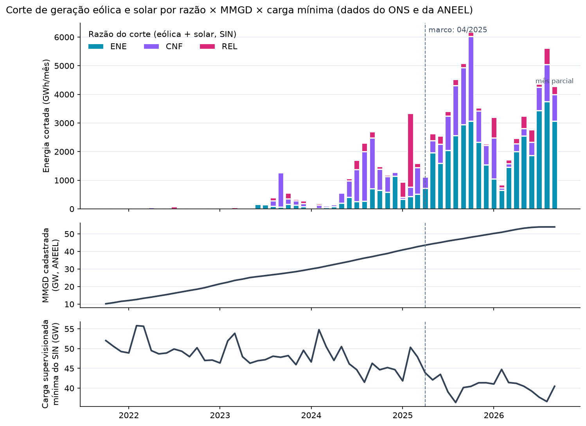

# Histórico mensal do corte por razão (Peça B / Figura 1)

Gerado por `python run_heavywork.py` (etapa `analises`; código em `Backend/src/analise/historico.py`). Não editar à mão.

## A razão energética domina o corte desde 04/2025? **quase sempre**

- Desde 04/2025: ENE é a maior razão em **17 de 18 meses** (exceções: 01/2026 (CNF)).
- Participação do ENE na energia cortada: **65%** desde o marco, contra 30% antes (38.611 GWh de corte ENE desde o marco).
- Energia cortada = GNRa (geração não realizada apurada, MW médio da semi-hora × 0,5 h) das bases tm de constrained-off do ONS, eólica (desde 10/2021) e solar (desde 04/2024), rateada entre razões pelos minutos de cada uma (mesma regra dos rótulos: `Backend/src/processing/tabelas.py`).
- MMGD cadastrada: potência acumulada do cadastro da ANEEL no fim de cada mês (data = atualização cadastral).
- Carga supervisionada mínima: menor semi-hora do mês no SIN (soma dos 4 subsistemas).
- O último mês (09/2026) é parcial.

## Mês a mês (GWh, % da energia cortada no mês)

| mês | ENE | CNF | REL | total | pct_ENE | pct_CNF | pct_REL | dominante | mmgd_cadastrada_gw | carga_sup_minima_gw |
|---|---|---|---|---|---|---|---|---|---|---|
| 2021-10 | 6 | 2 | 2 | 10 | 61 | 18 | 21 | ENE | 10.2 | 52.0 |
| 2021-11 | 6 | 0 | 1 | 7 | 77 | 7 | 16 | ENE | 10.8 | 50.6 |
| 2021-12 | 6 | 2 | 2 | 10 | 62 | 19 | 20 | ENE | 11.6 | 49.3 |
| 2022-01 | 0 | 21 | 3 | 24 | 0 | 88 | 12 | CNF | 12.1 | 48.9 |
| 2022-02 | 0 | 17 | 6 | 23 | 0 | 73 | 27 | CNF | 12.6 | 55.8 |
| 2022-03 | 0 | 22 | 16 | 38 | 0 | 57 | 43 | CNF | 13.4 | 55.7 |
| 2022-04 | 0 | 59 | 5 | 64 | 0 | 92 | 8 | CNF | 14.0 | 49.5 |
| 2022-05 | 11 | 0 | 8 | 19 | 57 | 0 | 43 | ENE | 14.7 | 48.7 |
| 2022-06 | 0 | 0 | 1 | 1 | 0 | 0 | 100 | REL | 15.4 | 48.9 |
| 2022-07 | 0 | 1 | 85 | 86 | 0 | 1 | 99 | REL | 16.2 | 49.9 |
| 2022-08 | 2 | 9 | 42 | 54 | 4 | 17 | 79 | REL | 17.0 | 49.3 |
| 2022-09 | 0 | 0 | 22 | 22 | 0 | 0 | 100 | REL | 17.8 | 48.0 |
| 2022-10 | 4 | 1 | 24 | 29 | 13 | 3 | 84 | REL | 18.5 | 50.2 |
| 2022-11 | 2 | 0 | 2 | 4 | 49 | 0 | 51 | REL | 19.4 | 47.0 |
| 2022-12 | 15 | 0 | 26 | 42 | 37 | 1 | 62 | REL | 20.5 | 47.1 |
| 2023-01 | 13 | 0 | 6 | 19 | 68 | 0 | 32 | ENE | 21.6 | 46.4 |
| 2023-02 | 0 | 6 | 4 | 11 | 0 | 59 | 41 | CNF | 22.5 | 52.0 |
| 2023-03 | 0 | 2 | 57 | 59 | 0 | 3 | 97 | REL | 23.5 | 53.9 |
| 2023-04 | 16 | 0 | 14 | 30 | 52 | 0 | 48 | ENE | 24.3 | 48.0 |
| 2023-05 | 33 | 0 | 4 | 36 | 90 | 0 | 10 | ENE | 25.2 | 46.3 |
| 2023-06 | 168 | 4 | 52 | 223 | 75 | 2 | 23 | ENE | 25.7 | 46.9 |
| 2023-07 | 153 | 3 | 27 | 184 | 83 | 2 | 15 | ENE | 26.2 | 47.2 |
| 2023-08 | 96 | 195 | 101 | 391 | 24 | 50 | 26 | CNF | 26.8 | 48.1 |
| 2023-09 | 67 | 1205 | 27 | 1299 | 5 | 93 | 2 | CNF | 27.3 | 47.8 |
| 2023-10 | 159 | 191 | 210 | 559 | 28 | 34 | 37 | REL | 27.9 | 48.2 |
| 2023-11 | 132 | 152 | 52 | 336 | 39 | 45 | 15 | CNF | 28.5 | 45.9 |
| 2023-12 | 87 | 104 | 89 | 280 | 31 | 37 | 32 | CNF | 29.2 | 49.6 |
| 2024-01 | 28 | 6 | 0 | 34 | 81 | 18 | 0 | ENE | 30.0 | 46.6 |
| 2024-02 | 15 | 125 | 50 | 190 | 8 | 66 | 27 | CNF | 30.8 | 54.8 |
| 2024-03 | 50 | 58 | 1 | 108 | 46 | 53 | 1 | CNF | 31.7 | 50.5 |
| 2024-04 | 76 | 74 | 9 | 159 | 48 | 46 | 6 | ENE | 32.6 | 47.0 |
| 2024-05 | 211 | 341 | 16 | 568 | 37 | 60 | 3 | CNF | 33.4 | 50.5 |
| 2024-06 | 409 | 576 | 79 | 1064 | 38 | 54 | 7 | CNF | 34.3 | 46.2 |
| 2024-07 | 255 | 1118 | 327 | 1701 | 15 | 66 | 19 | CNF | 35.3 | 44.7 |
| 2024-08 | 274 | 1728 | 298 | 2300 | 12 | 75 | 13 | CNF | 36.2 | 41.5 |
| 2024-09 | 707 | 1771 | 229 | 2707 | 26 | 65 | 8 | CNF | 37.1 | 46.3 |
| 2024-10 | 648 | 746 | 99 | 1492 | 43 | 50 | 7 | CNF | 38.0 | 44.7 |
| 2024-11 | 584 | 550 | 49 | 1183 | 49 | 47 | 4 | ENE | 38.8 | 45.2 |
| 2024-12 | 1140 | 138 | 10 | 1288 | 89 | 11 | 1 | ENE | 39.9 | 44.7 |
| 2025-01 | 342 | 62 | 532 | 936 | 37 | 7 | 57 | REL | 40.9 | 41.8 |
| 2025-02 | 438 | 330 | 2580 | 3347 | 13 | 10 | 77 | REL | 41.8 | 50.3 |
| 2025-03 | 522 | 927 | 145 | 1595 | 33 | 58 | 9 | CNF | 42.7 | 47.9 |
| 2025-04 | 720 | 394 | 23 | 1137 | 63 | 35 | 2 | ENE | 43.6 | 43.9 |
| 2025-05 | 1958 | 434 | 236 | 2628 | 75 | 17 | 9 | ENE | 44.4 | 42.1 |
| 2025-06 | 1595 | 665 | 296 | 2557 | 62 | 26 | 12 | ENE | 45.1 | 43.5 |
| 2025-07 | 2041 | 1211 | 157 | 3409 | 60 | 36 | 5 | ENE | 45.9 | 39.1 |
| 2025-08 | 2568 | 1745 | 218 | 4532 | 57 | 39 | 5 | ENE | 46.7 | 36.4 |
| 2025-09 | 2948 | 1983 | 154 | 5085 | 58 | 39 | 3 | ENE | 47.3 | 40.1 |
| 2025-10 | 3069 | 2958 | 157 | 6185 | 50 | 48 | 3 | ENE | 48.1 | 40.4 |
| 2025-11 | 2336 | 1093 | 103 | 3532 | 66 | 31 | 3 | ENE | 48.8 | 41.4 |
| 2025-12 | 1537 | 682 | 56 | 2275 | 68 | 30 | 2 | ENE | 49.5 | 41.4 |
| 2026-01 | 1051 | 1437 | 717 | 3204 | 33 | 45 | 22 | CNF | 50.3 | 41.0 |
| 2026-02 | 655 | 85 | 110 | 850 | 77 | 10 | 13 | ENE | 50.9 | 44.7 |
| 2026-03 | 1456 | 125 | 134 | 1715 | 85 | 7 | 8 | ENE | 51.7 | 41.4 |
| 2026-04 | 2011 | 260 | 193 | 2465 | 82 | 11 | 8 | ENE | 52.6 | 41.2 |
| 2026-05 | 2548 | 267 | 424 | 3240 | 79 | 8 | 13 | ENE | 53.2 | 40.5 |
| 2026-06 | 1866 | 459 | 448 | 2773 | 67 | 17 | 16 | ENE | 53.7 | 39.3 |
| 2026-07 | 3431 | 827 | 100 | 4358 | 79 | 19 | 2 | ENE | 53.9 | 37.7 |
| 2026-08 | 3751 | 1292 | 574 | 5618 | 67 | 23 | 10 | ENE | 54.0 | 36.6 |
| 2026-09 | 3068 | 933 | 276 | 4277 | 72 | 22 | 6 | ENE | 54.0 | 40.5 |
