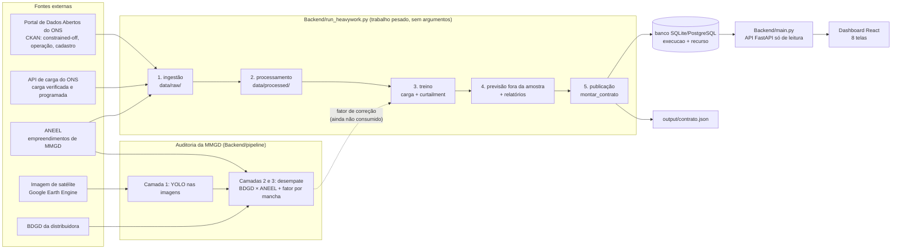

# O.R.A.C.U.L.O. — visão geral do sistema

*Observabilidade de Redes e Análise de Curtailment em Usinas e Limites Operacionais.*
Estado descrito: 26/09/2026. Detalhes de cada peça estão nos documentos linkados ao longo do texto;
o andamento tarefa a tarefa fica em [`STATUS.md`](STATUS.md) e o checklist em [`FASES.md`](FASES.md).

---

## 1. O problema e a resposta

O ONS enxerga bem o que está na Rede Básica, mas a **micro e minigeração distribuída (MMGD)**, que já
passa de 40 GW, está nas redes das distribuidoras e chega ao operador como estimativa agregada e com
cadastro atrasado. Isso afeta os dois desafios do hackathon:

| Desafio | Pergunta | O que o O.R.A.C.U.L.O. entrega |
|---|---|---|
| **2 — Demanda** | prever a carga que o ONS de fato opera | **carga supervisionada** (carga global − MMGD estimada), a cada 30 min, com quantis P10/P50/P90 nos horizontes **30 min, 3 h e D+1** |
| **1 — Curtailment** | antecipar cortes de geração eólica/solar | **risco de corte por razão** (ENE = razão energética, CNF = confiabilidade) por usina, com montante esperado em MW, explicação por variável e ação recomendada |

Os dois produtos dependem da mesma grandeza hoje pouco visível: **quanta MMGD existe e onde**. Por isso
existe um terceiro bloco, a **auditoria da MMGD em 3 camadas** (satélite + BDGD + cadastro da ANEEL), que
estima um fator de correção da capacidade instalada por "mancha" de rede.

O sistema **apoia a decisão**: não executa fluxo de potência nem estudos de estabilidade, não substitui os
modelos do ONS (PREVCARGA/PMO) e não automatiza despacho.

---

## 2. O sistema de ponta a ponta



São **duas partes ligadas só pelo banco**:

- **Trabalho pesado** (`python run_heavywork.py`, em `Backend/`): baixa, processa, treina, prevê e publica.
  Cada etapa tem uma "impressão digital" (dados + código + config) e é **pulada se nada mudou**; falha numa
  etapa interrompe as seguintes. Configuração em `Backend/config/heavywork.yaml`.
- **Serviço web** (`python main.py`): API FastAPI **só de leitura** sobre a última publicação, que também
  serve o build do dashboard. Não importa nada da parte pesada (há teste para isso).

---

## 3. De onde vêm os dados

| Fonte | O que traz | Como chega | Onde fica | Para que serve |
|---|---|---|---|---|
| **Portal de Dados Abertos do ONS** (dados.ons.org.br, API CKAN) | 12 conjuntos: constrained-off eólico e fotovoltaico (bases `tm`, 30 min, e `detail`), geração térmica por motivo de despacho, intercâmbio, fator de capacidade, balanço por subsistema, curva de carga, capacidade de geração, cadastro de usinas/conjuntos e modalidades | `src/ingestion/download.py` pergunta ao CKAN quais arquivos Parquet existem (meses novos entram sozinhos) e baixa só o que falta ou foi republicado | `Backend/data/raw/ons/` (Parquet particionado, fora do git) | rótulos de curtailment, cadastro das usinas, status das fontes |
| **API de carga do ONS** (apicarga.ons.org.br) | carga verificada (global, MMGD estimada, consistida) desde 2016, por área e subsistema; carga programada | mesmo módulo, janelas de 3 meses; janelas terminadas há menos de 45 dias são rebaixadas a cada execução, porque o ONS ainda consiste os dados | `data/raw/ons/carga_verificada` | alvo da previsão de carga |
| **ANEEL — empreendimentos de MMGD** (dadosabertos.aneel.gov.br) | potência instalada de MMGD por distribuidora, município e data | download direto, rebaixado a cada 7 dias | `data/raw/aneel/` | capacidade de MMGD (o ONS só publica a geração estimada). **O arquivo tem CPF/CNPJ e nomes: só UF, data e potência são lidos**; nada pessoal vai para as tabelas processadas |
| **MCP oficial do ONS** | camada semântica sobre 80 dos 85 conjuntos | inventariado ([`mcp_ons.md`](mcp_ons.md)), **não usado na ingestão**: não cobre a carga verificada | — | referência; publicar uma tool de previsão lá é opcional (cortável) |
| **IBGE — malhas** + **Natural Earth** | divisas das UFs e contorno do Brasil | baixados uma vez (`npm run geo:ufs`, `npm run geo:brasil`) e versionados | `Frontend/.../src/data/geo/` | fundo do Mapa Híbrido, 100% offline |
| **Imagem de satélite** (Google Earth Engine) | imagem da área piloto por bounding box | `pipeline/download_satelite.py` | `data/raw/satelite/` | Camada 1 da auditoria. **Pronto, ainda não rodado**: falta a área piloto e imagem submétrica (Sentinel-2, 10 m, não enxerga painel residencial) |
| **BDGD** (base geográfica da distribuidora) | unidades com GD, transformador, alimentador, potência | ingestão da área piloto **pendente** (Fase 6); `Backend/RDX/` é um trabalho anterior do time sobre LIGHT/ENEL-RJ | — | Camada 2 da auditoria (hoje com mock) |
| **ERA5 / previsão meteorológica** | clima | **não integrado** (decisão de 2026-09-25: baseline só com calendário e defasagens) | — | por isso os "fatores climáticos" do dashboard ainda são mock |

Inventário completo do portal: [`inventario_portal_ons.md`](inventario_portal_ons.md). Catálogo das séries
escolhidas: `Backend/data/catalogo_series_selecionadas.md`. Parâmetros da ingestão:
`Backend/config/fontes_ons.yaml`. Primeira ingestão completa: ~1,6 GB e ~30 min.

---

## 4. Como os dados são tratados (etapa 2)

Regras que valem para o projeto inteiro:

- **Tempo**: fuso único **UTC−3 fixo**; todo timestamp marca o **início** da semi-hora (19:00 = 19:00–19:30).
  Na tela, tudo é mostrado no horário de Brasília.
- **Subsistema ≠ área operativa**: os dois recortes só se cruzam pela tabela
  `Backend/data/processed/mapeamento_subsistema_area.csv`, através de `src/utils/joins.py` (única porta).
- **Feriado é tratado como domingo**; o Dia dos Pais (2º domingo de agosto) tem marcação própria.
- **Patamares e faixas horárias** (em `Backend/config/processamento.yaml`, lidos também pelo dashboard):
  mínima diurna 9–16h, rampa vespertina 16–19h, ponta noturna 19–22h; faixas de curtailment
  00–07 | 07–09 e 16–18 | 09–16 | 18–24.

Tabelas produzidas em `Backend/data/processed/` (fora do git, exceto o mapeamento):

| Tabela | Conteúdo | Decisões importantes |
|---|---|---|
| `calendario.csv` | cada semi-hora de 2016 a 2027 com dia da semana, feriado, patamar, faixa de curtailment | biblioteca `holidays` + regras do CLAUDE.md |
| `carga_supervisionada.csv` | por subsistema e semi-hora: carga global, MMGD estimada, carga supervisionada | **carga supervisionada = carga global − MMGD** (mesma base, MWmed, sem reamostrar); conferida contra o valor que o ONS publica; carga ≤ 0 vira NaN com flag; antes de fev/2019 não há MMGD (fica NaN, nunca zero) |
| `rotulos_curtailment.parquet` | ~16 M linhas: por usina e semi-hora, corte total e por razão (ENE, CNF) | chave = **fonte + id** (o `id_ons` repete entre eólica e solar); corte = GNRa oficial ou, quando não publicada, referência − geração (mesma fórmula); corte dividido entre razões pelos minutos de cada uma; restrição sem como medir = NaN (desconhecido, nunca zero) |
| `capacidade_mmgd.csv` | potência de MMGD cadastrada por UF e data | só três colunas do arquivo da ANEEL são lidas |

---

## 5. Os modelos (etapas 3 e 4)

### 5.1 Carga supervisionada — Desafio 2 (`src/models/carga.py`, `config/modelos_carga.yaml`)

- **Séries**: SE, S, NE, N e SIN (o SIN é modelado direto: soma de quantis de subsistemas não é quantil do SIN).
- **Horizontes**: 30 min, 3 h e D+1 (1, 6 e 48 passos). Um modelo **direto** por série × horizonte × quantil.
- **Entradas**: defasagens da carga supervisionada e da MMGD **conhecidas na emissão** (alvo − horizonte),
  médias móveis e calendário do alvo. Sem meteorologia por enquanto.
- **Baselines obrigatórios**: persistência, sazonal (mesmo horário do dia/da semana anterior) e climatologia.
- **Modelo**: LightGBM quantílico (P10/P50/P90) que aprende o **desvio** em relação a uma referência
  (persistência no 30 min; mesmo horário do dia anterior no 3 h e no D+1). Banda P10–P90 calibrada por
  conformal (CQR) com os últimos 182 dias do treino.
- **Split cronológico**: treino com alvos de mar/2019 a jun/2025; teste com emissões de jul/2025 a set/2026.
- **Resultado no SIN, fora da amostra** ([`reports/baseline_carga.md`](reports/baseline_carga.md)):

  | horizonte | MAE do LightGBM | melhor baseline | MAPE | cobertura P10–P90 |
  |---|---|---|---|---|
  | 30 min | 555 MW | 1.631 MW (persistência) | 0,76% | 74,8% |
  | 3 h | 1.559 MW | 3.172 MW (sazonal semanal) | 2,32% | 73,8% |
  | D+1 | 1.685 MW | 3.176 MW (sazonal semanal) | 2,51% | 74,4% |

  O LightGBM ganha do melhor baseline nas 15 combinações série × horizonte. A cobertura fica abaixo dos 80%
  ideais (a banda ainda é um pouco estreita).
- **Próximo passo**: Temporal Fusion Transformer com **perda assimétrica por patamar** (pune mais subestimar a
  ponta noturna e superestimar a mínima diurna, a lacuna que o ONS declarou). Bloqueado por um erro do torch
  no Windows da máquina de treino.

### 5.2 Risco de curtailment — Desafio 1 (`src/models/curtailment.py`, `config/modelos_curtailment.yaml`)

- **Unidade**: cada usina/conjunto (~290) × semi-hora × horizonte (os mesmos da carga).
- **Entradas** (todas até a emissão): histórico de corte da própria usina (agora, frações em 6 h/1 dia/1
  semana, mesmo horário do dia e da semana anteriores), **estado do sistema** (fração de usinas cortando no
  subsistema e no SIN), carga supervisionada e MMGD do subsistema e do SIN, calendário e faixa horária do alvo,
  fonte, subsistema, UF e a própria usina.
- **Modelos por razão** (ENE; CNF opcional): classificador LightGBM → P(corte); regressor LightGBM →
  E[MW | corte]; **montante esperado = P(corte) × E[MW | corte]**.
- **Split**: treino abr/2023 → dez/2025 (inclui o regime em que a razão energética passou a dominar, desde
  abr/2025); teste em 2026. Baselines: persistência e frequência recente.
- **Explicação**: SHAP exato calculado pelo próprio LightGBM, agrupado em rótulos legíveis ("velocidade do
  vento", "carga supervisionada prevista"...); o texto do alerta é gerado por uma função só
  (`pipeline/explicabilidade.py::gerar_texto_alerta`).
- **Publicação**: as 10 usinas de maior montante esperado; severidade pela probabilidade (≥ 80% crítico,
  ≥ 60% alto, ≥ 40% médio); ação recomendada por regra de texto por razão e faixa horária.
- **Limites**: REL (indisponibilidade externa) não é modelada; o CNF roda sem os limites de exportação NE e
  N/NE, que não existem no portal nem no MCP. As métricas do classificador com dado real ainda não estão
  neste repositório.

### 5.3 Garantias contra vazamento temporal

- Toda defasagem passa por `src/features/defasagens.py`, que recusa olhar depois da emissão; testes perturbam
  todo o "futuro" e exigem features idênticas.
- Um único split (`src/models/split.py`); um teste treina duas vezes mudando todo o período de teste e exige
  modelos idênticos.
- A previsão só emite pontos fora da amostra e recusa modelo salvo com outro split.

---

## 6. Publicação, banco e API (etapa 5 + serviço web)

**Publicação** (`src/publicacao/montar.py`): uma função única, `montar_contrato()`, monta os 7 recursos do
contrato e grava ao mesmo tempo `output/contrato.json` e o banco, numa transação só (nunca pela metade).
O **"agora"** é o do *modo replay*: por padrão, a última semi-hora com carga completa dos 4 subsistemas
(`config/publicacao.yaml`). Todo item passa pelo contrato antes de gravar; item de mock sem `"mock": true`
derruba a publicação.

**Banco** (SQLAlchemy 2 + Alembic; `DATABASE_URL` ou SQLite em `Backend/oraculo.db`): duas tabelas —
`execucao` (uma por publicação: quando e qual "agora") e `recurso` (cada item do contrato como JSON validado).
O formato vive num lugar só: o contrato.

**Contrato**: o `Frontend/.../src/data/types.ts` (schemas Zod) é o contrato oficial; o Backend tem o espelho
Pydantic em `src/contrato/modelos.py`, e `docs/schema_contrato.json` é gerado dele
([`schema_contrato.md`](schema_contrato.md)). Um teste impede que as duas pontas divirjam.

**API** (`Backend/main.py`, rotas geradas da tabela `RECURSOS`, prefixo `/api`):

| Rota | Recurso | Situação hoje |
|---|---|---|
| `GET /api/carga/snapshot` | carga global, MMGD, carga supervisionada, % MMGD, MMGD ÷ capacidade | **real** |
| `GET /api/previsao` | curvas P10/P50/P90 dos 3 horizontes + rampa + fatores climáticos | pontos **reais**; registro sai `mock` porque os fatores climáticos ainda são mock |
| `GET /api/riscos` | usinas com risco, razão, probabilidade, MW, severidade, ação | **reais**, exceto `distribuidora` (a definir) e posição (sede da UF) → sai `mock` |
| `GET /api/alertas/{id}` | detalhe glass box de um risco | **real** |
| `GET /api/excedentes` | excedente por área de concessão | **mock** até existir MMGD por mancha |
| `GET /api/validacao` | métricas do backtest, histórico de erro, metadados do modelo, status das fontes | **real** |
| `GET /api/mmgd/densidade` | pontos do mapa de calor de MMGD | **mock** (sintético) |
| `GET /api/saude` | qual execução está sendo servida e o seu "agora" | — |

Sem banco publicado, ou com publicação num contrato antigo, a API responde **503 com a instrução
"rode `python run_heavywork.py`"** (nunca 500). Detalhes: [`backend.md`](backend.md).

---

## 7. O dashboard (`Frontend/oraculo-dashboard`)

React 19 + Vite + TypeScript + Tailwind v4, estilo sala de controle (SCADA). Todo dado entra por
`src/data/dataSource.ts` e é validado pelo schema Zod na fronteira. Dois modos:
- **API** (padrão, `npm run dev`): busca em `/api`, que o Vite repassa ao Backend (endereço lido de
  `Backend/config/api.yaml`). Com `npm run build`, o próprio `python main.py` serve o dashboard.
- **Mock** (`npm run dev:mock`): lê `src/data/mock/*.json`; todo registro precisa de `"mock": true`.

A topbar sempre diz a origem: **"DADOS MOCK"**, **"DADOS DE dd/mm HH:MM"** (o "agora" publicado) ou
**"API INDISPONÍVEL"**. Todo card com registro mock leva o selo **MOCK**.

| Tela | O que mostra | De onde |
|---|---|---|
| Visão Geral | carga supervisionada, MMGD, risco agregado (média ponderada por MW), montante em risco, curva D+1, composição da carga, alertas ativos | carga, previsão, riscos |
| Mapa Híbrido | usinas em risco (cor = severidade, tamanho = MW), excedentes, calor de MMGD, painel sincronizado | riscos, excedentes, densidade de MMGD |
| Despacho Preditivo | equação carga global − MMGD = supervisionada, curva P10/P50/P90 por horizonte com rampa e patamares, fatores climáticos | carga, previsão |
| Lista de Riscos | usinas ordenadas por severidade, razão, probabilidade, MW, horizonte, ação | riscos |
| Detalhe do Alerta | texto do alerta, barras SHAP, ação recomendada, peso por razão, rastreabilidade até o dataset | alertas + riscos |
| Excedentes TSO-DSO | payload proposto da interface ONS–DSO, excedente por área, prioridade, ação ("Executar" só simula) | excedentes |
| Validação | MAE, RMSE, MAPE, skill, erro diário × baseline, status das fontes, metadados do modelo, limitações | validação |
| Metodologia | o método (fontes → evidências → produtos), patamares e faixas da config, auditoria, validação, limites, fontes técnicas | texto fixo + validação + config |

Os filtros NORMAL / LOADING / CRITICAL / NO-RISK da topbar escondem itens nas listas (alto e crítico ficam
sob CRITICAL) e cada tela diz quantos ficaram ocultos. Os KPIs de sistema não são filtrados.

---

## 8. Auditoria da MMGD em 3 camadas (`Backend/pipeline`, `config/visao.yaml`)

| Camada | Pergunta | Fonte | Cadência |
|---|---|---|---|
| 1 · realidade física | o painel existe e onde está? | imagem de satélite + YOLOv8-seg (`auditoria_camada1.py`) | periódica |
| 2 · topologia | a que alimentador/transformador está ligado? | BDGD | anual |
| 3 · cadastro | foi homologado, e quando? | planilha de GD da ANEEL | diária |

**Desempate** (`auditoria_camadas_2_3.py`), para cada painel detectado:
- está na BDGD → **Cadastrada**;
- fora da BDGD, homologado **depois** da data da BDGD → **Lag de Sistema** (MMGD legítima, atraso administrativo);
- fora da BDGD, homologado **antes** → **Divergência cadastral** (vai para revisão);
- fora das duas → **Não homologada** (exceção escalada; **não entra** no fator).

**Fator de correção por mancha** = capacidade auditada (área detectada × 0,18 kWp/m², premissa) ÷ capacidade
cadastrada na BDGD. O casamento painel ↔ cadastro é por distância (até 25 m), um para um.

Situação: o fluxo roda de ponta a ponta **só em modo mock** (painéis, BDGD e ANEEL sintéticos, marcados).
O modelo disponível (`best.pt`) é um YOLOv8s-seg público, sem ajuste local; em teste com fotos comuns marcou
"solar-panel" onde não havia painel. A validação (`validar_modelo.py`) só declara o modelo "adequado" com um
gabarito de imagens da área. O fator ainda **não é consumido** pelos modelos (`caminho_fator_correcao` vazio
em `config/projeto.yaml`).

---

## 9. Teste ponta a ponta (`python -m pipeline.teste_e2e`)

Percorre bases → modelos → contrato → dashboard → alerta → auditoria e grava
[`reports/teste_e2e.md`](reports/teste_e2e.md). O status de cada etapa (real, mock, parcial, ausente) é **lido
dos próprios dados** (existência dos arquivos e flag `mock` de cada registro), não declarado em config: quando
uma saída real substituir um mock, o relatório muda sozinho e o dashboard não precisa mudar.

Inclui o cenário **Dia dos Pais de 2024** (11/08/2024, primeira restrição total de eólicas e fotovoltaicas por
baixa demanda): com as bases, extrai do dado real a carga supervisionada mínima do SIN e a fração de usinas
cortando; sem elas, mostra só a referência do PAR/PEL 2025 (39.024 MW), rotulada como tal. Essa data está no
treino do classificador, então serve como caso documentado, não como backtest.

---

## 10. Regras que o código garante (e não só a documentação)

- **Nunca inventar dados**: todo sintético tem `mock: true`/`is_mock`, é registrado em
  [`real_vs_mock.md`](real_vs_mock.md), aparece com selo na tela e não passa pela publicação sem a flag.
- **Split sempre cronológico**, com testes de vazamento temporal em cada modelo.
- **Dado bruto** (`data/raw`) só é tocado pela ingestão e pelo processamento (inclusive de imagem); o resto
  usa `data/processed` (teste de estrutura).
- **Parâmetros em `Backend/config/*.yaml`**; o dashboard lê do Backend o que é compartilhado (porta da API,
  patamares, faixas horárias).
- **Raiz do repositório** só com `Backend/`, `Frontend/` e `docs/`; sem notebooks.
- **Sem dependência externa em tempo de execução no dashboard**: fontes empacotadas e mapa sem tiles remotos
  (teste impede a volta).

---

## 11. O que é real hoje e o que falta

| Peça | Situação |
|---|---|
| Ingestão ONS/ANEEL, tabelas processadas | real (na máquina que rodou o `run_heavywork.py`) |
| Previsão de carga (LightGBM + baselines) e validação | real, com backtest publicado |
| Classificador de curtailment + alertas com SHAP | real no código e na publicação; métricas com dado real ainda não publicadas aqui |
| Fatores climáticos | mock (sem fonte meteorológica) |
| Distribuidora e posição da usina no risco | a definir / sede da UF |
| Excedentes, densidade de MMGD | mock até existir MMGD por mancha |
| Auditoria da MMGD | pipeline pronto, rodando só com mock |
| TFT com perda assimétrica | pendente (torch no Windows) |

Pendências principais: confirmar a **área piloto** e sua bounding box; ingerir a **BDGD**; conseguir **imagem
submétrica** e um **gabarito** para o YOLO; definir o campo `distribuidora`; rodar o teste e2e na máquina com as
bases; **unificar os limiares de severidade**, hoje diferentes entre o Backend (40/60/80%, na lista de riscos) e
o KPI agregado do dashboard (25/50/75%, em `src/data/derivados.ts`) — o mesmo 57,8% aparece como "Alto" no KPI
e seria "Médio" na lista.

---

## 12. Onde fica cada coisa

```
Backend/
  run_heavywork.py        trabalho pesado (etapas 1–5)
  main.py                 serviço web (API + dashboard buildado)
  config/*.yaml           todos os parâmetros (fontes, processamento, modelos, publicação, API, visão, e2e)
  src/ingestion/          download idempotente (CKAN, API de carga, ANEEL)
  src/processing/         tabelas processadas e mapeamento subsistema × área
  src/features/           features compartilhadas (defasagens seguras, calendário, carga, curtailment)
  src/models/             carga, curtailment, split, métricas e relatórios
  src/publicacao/         montar_contrato() e publicação
  src/contrato/           espelho Pydantic do contrato (tabela RECURSOS)
  src/db/, migrations/    banco (SQLAlchemy + Alembic)
  src/api/                rotas FastAPI
  pipeline/               explicabilidade, auditoria da MMGD, visão computacional, teste e2e
  tests/                  pytest (inclui estrutura, vazamento temporal, contrato, API)
  RDX/                    trabalho anterior do time (subestações LIGHT/ENEL-RJ, BDGD + CNEFE)
Frontend/oraculo-dashboard/
  src/data/               contrato (types.ts), dataSource, derivados, mocks
  src/pages/              uma página por tela
  src/components/         layout, ui, gráficos, mapa
  src/content/            textos fixos e calendário lido da config do Backend
docs/                     esta visão geral, STATUS, FASES, planejamento, contrato, real vs. mock, relatórios
```

Como rodar: seção "Como rodar o projeto" do [`README.md`](../README.md).

---

## Glossário rápido

| Termo | Significado |
|---|---|
| Carga global | toda a demanda, inclusive a atendida por geração que o ONS não supervisiona |
| Carga supervisionada | carga global − MMGD (e Tipo III): a carga que o ONS opera |
| MMGD | micro e minigeração distribuída (sobretudo solar em telhados) |
| Curtailment / constrained-off | redução de geração solicitada pelo ONS; termos equivalentes na regulação brasileira |
| ENE / CNF / REL | razão energética / confiabilidade elétrica / indisponibilidade externa (dicionário do ONS) |
| TSO / DSO | operador da transmissão (ONS) / operador da distribuição (ainda não constituído no Brasil) |
| BDGD | Base de Dados Geográfica da Distribuidora (ANEEL) |
| Modo replay | a demo publica previsões de um "agora" passado já conhecido, para mostrar o que o sistema teria dito |
| P10 / P50 / P90 | quantis da previsão: 80% dos valores reais devem cair entre P10 e P90 |
